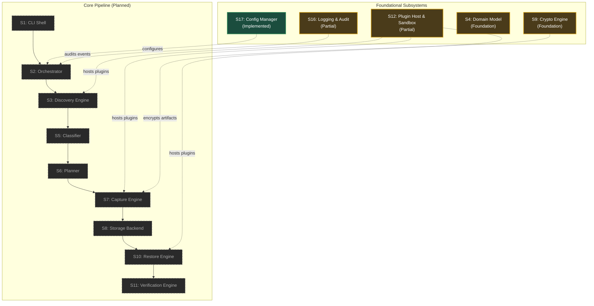

# Telos

[](https://github.com/temanhattan/AERS/actions/workflows/ci.yml)

> **Status:** Early development, pre-V1 (Phase 1: Foundation). Not yet production-ready.

**Telos** is an intelligent, security-first platform designed to discover, securely capture, and deterministically reconstruct computing environments. Rather than blindly copying disk blocks or file trees, Telos analyzes an environment to understand its operating system, configurations, installed software, and operational intent, enabling reproducible recovery across physical, virtual, and cloud targets.

---

## Current Status

Implementation is in Phase 1 (Foundation). Progress is tracked by subsystem maturity and test evidence:

| Subsystem | Status | Description |
| --------- | ------ | ----------- |
| **S17: Configuration Manager** | Implemented | 5-tier merge (defaults, system, user, env, flags), strict schema/business validation, per-setting attribution, immutable profile. |
| **S16: Logging & Audit** | Partial | Structured JSON logging via zerolog, component tagging, correlation IDs, dedicated `audit` severity. Log rotation/file output pending. |
| **S4: Domain Model** | Foundation | Behavior-free Go structs in `internal/model` representing manifests, plans, profiles, and archive records. Sealing logic pending. |
| **S9: Crypto Engine** | Foundation | Argon2id key derivation, AES-256-GCM authenticated envelopes, and general vs. credential key separation. Container format pending. |
| **S12: Plugin Host & Sandbox** | Partial | Manifest validation, offline checks, ADR-0012 limits, slice isolation, Linux sandbox (Landlock ABI v1–v7, seccomp BPF, namespaces). Stderr bounding, subprocesses (ADR-0007), staging (ADR-0013), and trust verification pending. |
| **S1: CLI Shell** | Planned | Skeleton `cmd/telos/main.go` exists (sandbox re-exec helper & logger demo). Argument parsing not implemented. |
| **S2: Orchestrator** | Planned | Pipeline coordination engine unwritten. |
| **S3, S5, S6: Discovery, Classifier, Planner** | Planned | Environment inspection, intent classification, and blueprint planning unwritten. |
| **S7, S8: Capture & Storage** | Planned | Archive generation and storage engine unwritten. |
| **S10, S11, S14: Restore, Verification, Diff** | Planned | Environment reconstruction, integrity checking, and state diffing unwritten. |
| **S13, S15: AI Advisory & Scheduler** | Planned | LLM/rule advisory layer and scheduled backup tasks unwritten. |

For detailed engineering evidence, see [docs/99_Project_Status.md](docs/99_Project_Status.md).

---

## Architecture

Telos separates the stable core pipeline from variant OS and application logic through a sandboxed Plugin API boundary:



---

## Security Model

The security model isolates untrusted plugin code and protects system integrity:

### Implemented OS-Level Enforcement (Linux)
- **Landlock LSM (ABI v1–v7):** Restricts filesystem access to declared `ReadPaths` and `WritePaths`. Executables receive explicit execute rights; `WritePaths` strictly mask out execute permissions.
- **Seccomp-BPF Syscall Filtering:** Denies `clone3` with `ENOSYS`, container/namespace clones (`CLONE_NEWUSER`, etc.) with `EPERM`, and blocks `mount`, `unshare`, and `setns` with `EPERM`.
- **Linux Namespaces:** Isolates child processes into private PID namespaces and unshared network namespaces with `loopback DOWN`.
- **Privilege Confinement:** Sets `PR_SET_NO_NEW_PRIVS` prior to plugin execution.
- **Resource Limits (`prlimit`):** Enforces ADR-0012 limits: 512 MB virtual memory (`RLIMIT_AS`), 10 GB maximum file size (`RLIMIT_FSIZE`), and task limits (`RLIMIT_NPROC` 0 / disabled).
- **Network Invariants:** Rejects `Discovery` and `Capture` plugins declaring `network: true` at manifest load time.
- **Policy Slice Isolation:** Defensively allocates and clones `Policy` path slices to prevent registry aliasing.

### Non-Linux Fallback (Windows & macOS)
- Standard subprocess execution without Landlock, seccomp BPF, or namespace containment. Falls back to process timeouts and application-level path validation. Emits an `audit` warning at startup.

### Not Yet Enforced
- **Subprocess Authorization (ADR-0007):** Resolving host binaries and granting Landlock access to system libraries (`/lib`, `/usr/lib`) is not implemented.
- **Capture Staging Lifecycle (ADR-0013):** Isolated temporary staging directories and artifact subpath traversal validation are not implemented.
- **Direct Path Stderr Limit:** Direct `Invoke()` path uses an unbounded buffer (sandbox paths use a hardcoded 1 MB limit).
- **Trust Verification:** Digital signatures, trusted key management, TOFU, and package integrity verification are unwritten.

---

## Getting Started

### Prerequisites
- **Go:** `1.26.4` (specified in [go.mod](go.mod)).
- **Linux / WSL2:** Required for kernel sandbox integration tests (Landlock, seccomp, namespaces).

### Build & Test

```bash
# Build all packages and binaries
go build ./...

# Run static analysis
go vet ./...

# Run test suite
go test ./... -count=1

# Run with race detector (Linux)
go test ./... -race -count=1
```

> **Note on Sandbox Tests:** The Linux sandbox integration tests require root privileges or capabilities (`CAP_SYS_ADMIN`) to create PID and network namespaces. When executed by unprivileged users or in standard CI containers, namespace-dependent tests skip (`EPERM`). Full runtime verification requires running as root in Linux or WSL2.

*Note: CLI commands such as `telos backup` or `telos restore` are not yet functional. `cmd/telos/main.go` currently serves as the sandbox re-exec helper and demo logger.*

---

## Project Layout

```
.
├── .github/workflows/ci.yml       # GitHub Actions CI pipeline (Linux/Windows test, lint, build)
├── cmd/
│   └── telos/                     # Application entry point & sandbox re-exec helper
├── core/
│   └── some_subsystem.go          # Temporary demo subsystem demonstrating logger injection (TD-1)
├── docs/                          # Architecture specs, requirements, threat model, ADRs, status
│   ├── ADRs/                      # Architecture Decision Records (ADR-0001 through ADR-0013)
│   └── reports/                   # Security, audit, and plugin gap resolution reports
├── internal/
│   ├── config/                    # Configuration Manager (S17): 5-tier merge, validation, profile
│   ├── crypto/                    # Crypto Engine (S9 foundation): Argon2id KDF, AES-256-GCM envelopes
│   ├── logger/                    # Logging & Audit (S16): structured JSON logging with audit level
│   ├── model/                     # Domain Model (S4): environment manifest, plans, archive entities
│   └── plugin/                    # Plugin Host (S12): manifest parsing, validation, and invocation
│       └── sandbox/               # Linux sandbox: Landlock, seccomp BPF, namespaces, limits
├── plugins/                       # Directory for plugin packages (empty placeholder)
├── storage/                       # Storage provider implementations (empty placeholder)
├── tests/                         # Cross-subsystem test suites (empty placeholder)
├── go.mod                         # Go module definition (Go 1.26.4, module telos)
└── go.sum                         # Checksums for direct and transitive dependencies
```

---

## Documentation Index

| Document | Description |
| -------- | ----------- |
| [Vision](docs/00_Vision.md) | Mission statement, teleological recovery philosophy, and core principles. |
| [Requirements](docs/01_Requirements.md) | Functional (FR-1–FR-14) and non-functional requirements. |
| [Architecture](docs/02_Architecture.md) | Complete specification of all 17 subsystems and data flow contracts. |
| [Threat Model](docs/03_Threat_Model.md) | STRIDE analysis, attack surfaces, trust boundaries, and mitigations. |
| [Data Model](docs/04_Data_Model.md) | Canonical entities, manifest structure, and entity lifecycle states. |
| [Plugin API](docs/05_Plugin_API.md) | Plugin contracts, JSON-over-stdio protocol, and capability requirements. |
| [Project Context](docs/08_PROJECT_CONTEXT.md) | Onboarding guide, document index, and system design summary. |
| [Project Status](docs/99_Project_Status.md) | Active engineering status, verification logs, open issues, and next steps. |
| [ADRs](docs/ADRs/) | Architecture Decision Records (ADR-0007, 0009–0013 accepted; 0001–0006, 0008 empty stubs). |
| [Reports](docs/reports/) | Security remediation and first-party plugin audit reports. |
| [Coding Standards](docs/06_Coding_Standards.md) | Development standards *(empty stub)*. |
| [Roadmap](docs/07_Roadmap.md) | Phase scheduling and milestone targets *(empty stub)*. |

---

## Roadmap

Remaining foundational items in strict dependency order (from [docs/99_Project_Status.md](docs/99_Project_Status.md)):

1. **Item B:** Bounded stderr collector on direct `Invoke()` path and single authoritative limit.
2. **RLIMIT_AS Investigation & ADR-0012 Amendment (pending):** Resolve minimal compiled Go fixture startup failure (`fatal error: failed to reserve page summary memory` under 512 MB virtual memory cap; blocks APT plugin).
3. **Item S0:** Subprocess security analysis review.
4. **Item D:** Subprocess permission handling per ADR-0007 (basename validation, LookPath, Landlock library grants).
5. **Items E1, E2, E3:** Capture staging lifecycle per ADR-0013 (staging allocator, request wiring, artifact subpath validation).
6. **Subsystem Milestones:** CLI Shell (S1, resolving TD-1 placeholder), Orchestrator (S2), Discovery Engine (S3), Capture Engine (S7), and Storage (S8).
