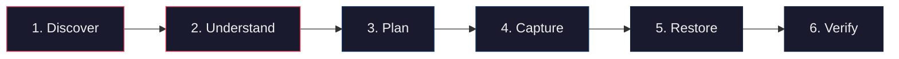
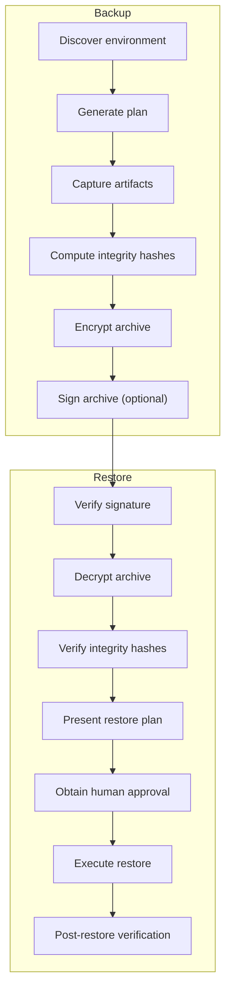
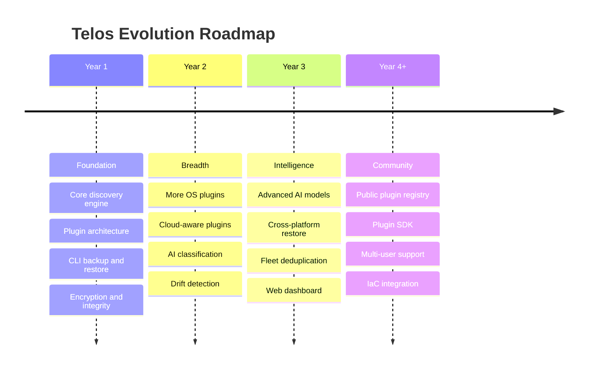

# Telos — Project Vision

> **Status:** Ratified
> **Last Updated:** 2026-06-30
> **Owner:** temanhattan
> **Audience:** All future contributors, AI sessions, and design reviewers

---

## Table of Contents

1. [Project Vision](#project-vision)
2. [Concept & Symbolism: Why Telos?](#concept--symbolism-why-telos)
3. [Mission Statement](#mission-statement)
4. [Long-Term Vision](#long-term-vision)
5. [Core Objectives](#core-objectives)
6. [Design Philosophy](#design-philosophy)
7. [Target User](#target-user)
8. [Primary Use Cases](#primary-use-cases)
9. [Success Criteria](#success-criteria)
10. [Guiding Principles](#guiding-principles)
11. [Scope](#scope)
12. [Security Philosophy](#security-philosophy)
13. [AI Philosophy](#ai-philosophy)
14. [Future Expansion](#future-expansion)
15. [Non-Goals](#non-goals)

---

## Project Vision

Telos — exists to solve a problem that traditional backup tools ignore: a computer is not just its files.

A working environment is the result of an operating system, a set of installed packages, a collection of configuration decisions, a network of credentials and services, a library of personal data, and the invisible connective tissue that ties all of these together. When a machine is lost, reformatted, or migrated, simply restoring files does not recreate the environment. The user is left to remember what was installed, how it was configured, and why certain decisions were made.

Telos is designed to **understand** an environment before it backs anything up. It discovers the operating system, identifies the role of the machine, catalogs installed technologies, determines what data is meaningful, and constructs an intelligent blueprint that captures the *intent* of the environment — not merely its artifacts.

The ultimate goal is **deterministic environment reconstruction**: given a compatible target machine and a Telos blueprint, the user can recreate a functionally identical working environment with confidence, speed, and zero-trust security.

---

## Concept & Symbolism: Why *Telos*?

> **Telos** (Ancient Greek: *τέλος*) is Aristotle's philosophical concept denoting the ultimate purpose, inherent end-goal, and true function of an entity or system.

In teleology, an entity is defined not merely by its physical substrate (its raw matter or dumb disk bytes), but by its **purpose and intent** (its *telos*).

Traditional backup utilities commit a category error: they treat machines as piles of disconnected storage blocks. When disaster strikes, they copy raw artifacts without understanding what they were for.

**Telos** is built on the realization that an environment is an expression of human and operational intent:

```
  Traditional Backups (Artifact-Centric):
  [ Dumb Files / Raw Bytes ] ─── Blind Copy ───► [ Fragile & Incomplete Restore ]

  Telos (Teleology & Intent-Centric):
  [ Source Machine ] ──► (Discovers Intent & Role) ──► [ Telos Blueprint ] ──► (Deterministic Fulfillment) ──► [ Working Environment ]
```

1. **Discovery as Teleological Comprehension**: Before taking action, Telos investigates the system to uncover its *telos*—why software was installed, how services interact, and what role the machine performs (e.g., developer workstation, reverse proxy, cybersecurity laboratory).
2. **Intent Over Artifacts**: Capturing the *why* allows Telos to minimize archive size and maximize portability. If a package exists in a package manager, we capture the intent to have version *X*, not a dead binary.
3. **Reconstruction as Fulfillment**: Restoration is the deterministic fulfillment of the machine's *telos* onto a target system, intelligently translating and adapting configurations to realize its operational purpose.

---

## Mission Statement

**To build an intelligent, secure, and extensible platform that discovers, understands, and reconstructs computing environments — treating backup as a byproduct of comprehension, not an act of blind file copying.**

---

## Long-Term Vision

Over the span of several years, Telos should evolve from a single-user personal tool into a mature, plugin-driven platform capable of:

- **Environment fingerprinting** — producing a portable, machine-readable description of any supported environment that can be version-controlled, compared, and audited.
- **Cross-platform reconstruction** — restoring a Linux development environment onto a fresh Linux machine, a Windows cybersecurity lab onto a new VM, or a cloud instance onto a different provider — with intelligent adaptation where configurations are not directly portable.
- **AI-assisted discovery** — leveraging machine learning models to identify non-obvious environment components, detect anomalies, suggest backup optimizations, and predict restore conflicts before they occur.
- **Trust-nothing security** — encrypting, signing, and verifying every backup artifact with zero-trust assumptions, so that a backup is safe even if the storage medium is compromised.
- **Community extensibility** — offering a stable plugin architecture that allows third-party contributors to add support for new operating systems, package managers, cloud providers, and application ecosystems without modifying the core.

Telos is not a product that ships once. It is a platform that grows as the environments it protects grow.

---

## Core Objectives

| # | Objective | Description |
| --- | ----------- | ------------- |
| 1 | **Discover** | Automatically identify the operating system, installed software, active services, user configurations, and data layout of the source machine. |
| 2 | **Understand** | Classify the role of the machine (developer workstation, server, lab, etc.) and determine what is essential versus what is transient or reproducible. |
| 3 | **Plan** | Generate a structured, human-reviewable backup plan that explains *what* will be captured and *why*. |
| 4 | **Capture** | Execute the approved backup plan, producing a secure, compressed, and encrypted backup archive with full integrity verification. |
| 5 | **Restore** | Reconstruct the environment on a compatible target machine, reinstalling packages, reapplying configurations, restoring data, and validating the result. |
| 6 | **Verify** | Provide post-restore verification that confirms the reconstructed environment matches the original within defined tolerances. |



---

## Design Philosophy

### Discovery Before Backup

The system must never begin a backup blindly. Before any data is captured, Telos performs a comprehensive discovery phase that identifies the operating system, hardware profile, installed software, running services, user configurations, scheduled tasks, environment variables, and data locations. This discovery produces a structured **Environment Manifest** — a machine-readable description of the environment that forms the foundation for every subsequent decision.

### Intent Over Artifacts

A backup should capture *why* something exists, not just *that* it exists. When Telos discovers that `nginx` is installed, it should record the intent: "this machine serves as a reverse proxy." When it finds a `.bashrc` file, it should understand that this is a user shell configuration, not an arbitrary dot file. Intent-awareness enables smarter restore decisions — for example, choosing to reinstall `nginx` from the target OS's package manager rather than copying a binary that may not be compatible.

### Minimum Backup Size, Maximum Recoverability

Telos should never back up what can be reconstructed. If a package is available in a public repository, the backup should store the package name and version — not the package itself. If a configuration file is the default, it should be omitted. The backup should contain only the **delta** between a clean OS installation and the discovered environment, plus all irreplaceable user data. This philosophy keeps backup sizes small, transfer times short, and storage costs low — without sacrificing recoverability.

### Deterministic Restore

Given the same backup archive and a compatible target machine, the restore process should produce the same result every time. Randomness, implicit ordering, and undocumented side effects are design defects. Every restore step should be logged, auditable, and reproducible.

### Modular Plugin Architecture

The core of Telos should be small, stable, and unopinionated. All operating-system-specific logic, all package-manager integrations, all cloud-provider adapters, and all application-specific backup strategies should be implemented as **plugins** that register with the core through a well-defined interface. Adding support for a new Linux distribution should never require modifying core logic.

### Human Approval Before Destructive Operations

Telos should never overwrite, delete, or modify data on a target machine without explicit human approval. The restore process should present a detailed plan, highlight potential conflicts, and wait for confirmation before proceeding. Automation is a tool; the human is the authority.

---

## Target User

### Primary User

The primary user is a **single developer** who manages a diverse fleet of personal machines across multiple operating systems, virtualization platforms, and cloud providers.

### Typical Environment Profile

| Environment Type | Examples |
| ----------------- | ---------- |
| Personal workstations | Laptops running Windows, Ubuntu, or Debian |
| Virtual machines | VMware Workstation, VirtualBox guests |
| Cloud instances | AWS EC2, Google Cloud Compute Engine |
| Development environments | Full-stack development setups with multiple runtimes, editors, and tools |
| Cybersecurity labs | Intentionally configured penetration testing and defense environments |

### User Expectations

- The user is technically sophisticated and comfortable with terminal interfaces.
- The user values transparency — they want to see and approve what the system is doing.
- The user expects the system to work across their entire fleet, not just one OS.
- The user does not want to manually maintain backup configuration files.
- The user expects backups to be secure enough that they can be stored on untrusted media.

---

## Primary Use Cases

### UC-1: New Machine Setup

> *"I just bought a new laptop. I want my entire development environment — tools, configurations, SSH keys, shell aliases, editor settings, project scaffolding — reconstructed without manually remembering what I had."*

Telos discovers the existing environment, backs it up, and restores it onto the new machine, adapting where necessary for hardware or OS differences.

### UC-2: VM Snapshot and Clone

> *"I have a cybersecurity lab VM that took hours to configure. I want to capture its exact state so I can clone it or rebuild it if the VM is destroyed."*

Telos captures the full environment — installed tools, network configurations, custom scripts, and datasets — and can reconstruct it onto a fresh VM image.

### UC-3: Cloud Migration

> *"I'm moving from AWS to Google Cloud. I need my server environment recreated on the new provider without manually reinstalling everything."*

Telos understands the cloud-specific components (security groups, IAM roles, installed agents) and separates portable configuration from provider-specific infrastructure, guiding the user through the migration.

### UC-4: Disaster Recovery

> *"My laptop's drive failed. I have a Telos backup on an external drive. I need to get back to work."*

Telos restores the full environment onto a replacement machine, prioritizing the most critical components first so the user can resume work as quickly as possible.

### UC-5: Environment Audit

> *"I want to know exactly what is installed on this machine, what has changed since the last backup, and whether anything unexpected has appeared."*

Telos performs a discovery scan and compares the result against the last known Environment Manifest, producing a human-readable diff report.

---

## Success Criteria

The project is considered successful when the following conditions are met:

| # | Criterion | Measurement |
| --- | ----------- | ------------- |
| 1 | A fresh Ubuntu machine can be reconstructed from a Telos backup within 30 minutes (excluding download time for large packages). | Timed restore test. |
| 2 | A fresh Windows machine can be reconstructed from a Telos backup within 45 minutes (excluding download time). | Timed restore test. |
| 3 | The backup archive for a typical development laptop is less than 20% of the total disk usage. | Size comparison. |
| 4 | The restore process never modifies the target machine without explicit human approval. | Audit log review. |
| 5 | All backup archives are encrypted at rest and integrity-verified before restore. | Cryptographic verification. |
| 6 | A plugin for a new Linux distribution can be developed and integrated without modifying core source files. | Plugin development test. |
| 7 | The post-restore environment passes a verification scan confirming functional equivalence with the original. | Automated verification report. |

---

## Guiding Principles

### 1. Comprehension Precedes Action

The system must understand what it is looking at before it acts. No backup runs without a discovery phase. No restore runs without a plan. No plan executes without approval.

### 2. Transparency Is Non-Negotiable

Every decision the system makes must be explainable. If Telos decides to skip a file, the user should be able to ask why. If it decides to include a directory, the reason should be logged. Black-box behavior is a design failure.

### 3. Security Is Not a Feature — It Is the Foundation

Encryption, integrity verification, and access control are not optional add-ons. They are baked into every layer of the system. A backup that is not encrypted is not a backup — it is a liability.

### 4. Failures Must Be Recoverable

If a restore is interrupted halfway through, the system must be able to resume from the point of interruption without corruption or duplication. Partial failure must never produce an inconsistent state.

### 5. Simplicity Over Cleverness

A straightforward solution that is easy to understand, test, and debug is always preferred over an elegant solution that is difficult to maintain. Future AI sessions and human contributors must be able to read the codebase and understand it without extensive onboarding.

### 6. Convention Over Configuration

Where reasonable, the system should adopt sensible defaults that work for the primary user without requiring manual configuration. Configuration should be available for customization but never *required* for basic operation.

### 7. Offline-First

The system must function fully without an internet connection. Network access may be required for downloading packages during restore, but all discovery, planning, backup, and verification operations must work offline.

---

## Scope

### In Scope

The following capabilities are within the scope of Telos:

- **Operating system discovery** — identifying the OS family, version, architecture, and kernel.
- **Package manager integration** — cataloging installed packages across apt, dnf, pacman, winget, chocolatey, snap, flatpak, pip, npm, cargo, and similar managers.
- **Service and daemon discovery** — identifying running services, their configurations, and startup behavior.
- **User configuration capture** — dot files, shell configurations, editor settings, desktop environment preferences.
- **SSH and credential management** — securely backing up SSH keys, GPG keys, and authentication tokens with additional encryption.
- **Environment variable capture** — system and user environment variables, PATH configurations.
- **Scheduled task capture** — cron jobs, systemd timers, Windows Task Scheduler entries.
- **Network configuration** — interface settings, DNS configuration, VPN profiles, firewall rules.
- **Cloud instance metadata** — provider-specific instance information relevant to reconstruction.
- **Custom data directories** — user-designated directories containing irreplaceable data (projects, documents, datasets).
- **Backup encryption and signing** — AES-256 encryption, SHA-256 integrity hashes, optional GPG signing.
- **Differential and incremental backups** — capturing only what has changed since the last backup.
- **Restore planning and execution** — generating a restore plan, obtaining approval, and executing the restore.
- **Post-restore verification** — validating that the restored environment matches the original.
- **Plugin architecture** — a stable interface for extending the system with new OS, package manager, and application support.
- **CLI interface** — a terminal-based interface as the primary interaction model.

### Out of Scope

The following capabilities are explicitly outside the scope of Telos:

- **Full disk imaging** — Telos is not a disk cloner. It does not capture raw disk images or partition tables.
- **Real-time synchronization** — Telos is not a sync tool like rsync or Dropbox. It performs point-in-time backups.
- **GUI interface** (initial release) — the initial release targets CLI only. A GUI may be added in future phases.
- **Multi-user collaboration** — the system is designed for a single user. Multi-tenant support is not planned.
- **Proprietary application state** — Telos does not attempt to back up internal state of proprietary applications (e.g., Adobe license activations, game save files in proprietary formats) unless a dedicated plugin is written.
- **Mobile device backup** — iOS and Android devices are not supported.
- **Bare-metal provisioning** — Telos assumes a base OS is already installed on the target machine. It does not perform OS installation.

---

## Security Philosophy

Security in Telos is not a layer added on top of functionality. It is a constraint that shapes every design decision from the ground up.

### Zero Trust

Telos assumes that every storage medium, every network path, and every intermediate system is potentially compromised. Backup archives are encrypted before they leave the source machine. Integrity hashes are computed before encryption and verified after decryption. No backup artifact is ever stored in plaintext on any medium, including local staging directories.

### Principle of Least Privilege

The system requests only the permissions it needs for the current operation. Discovery scans should run with read-only access wherever possible. Write access is requested only during restore, and only for the specific paths being restored.

### Credential Isolation

Sensitive materials — SSH private keys, API tokens, GPG secret keys, database passwords — receive a higher tier of protection than general configuration files. These materials are encrypted with a separate key or passphrase and are never included in a backup archive without explicit user acknowledgment.

### Auditability

Every operation the system performs is logged with sufficient detail to reconstruct the sequence of events after the fact. Logs include timestamps, operation types, affected paths, and outcomes. Logs themselves never contain sensitive data (keys, passwords, tokens).

### Integrity Verification Chain

Every backup archive includes a cryptographic manifest listing the hash of every included artifact. Before restore begins, the manifest is verified against the archive contents. If any artifact fails verification, the restore is halted and the user is notified. The system never silently restores corrupted data.



---

## AI Philosophy

AI is a **tool** within Telos, not a decision-maker. The system uses AI to enhance human capability, not to replace deterministic logic.

### The Role of AI

AI assists Telos in areas where heuristic or rule-based approaches are insufficient:

| Domain | AI Contribution | Deterministic Fallback |
| -------- | ---------------- | ---------------------- |
| **Environment classification** | Suggesting the role of a machine (e.g., "this looks like a web server") based on installed packages and running services. | The user can manually specify the role. |
| **Importance scoring** | Estimating which files and directories are likely to be important based on access patterns, file types, and known conventions. | The user can override importance scores or define explicit include/exclude rules. |
| **Anomaly detection** | Flagging unexpected changes between the current environment and the last backup (e.g., "a new SUID binary appeared in /usr/local/bin"). | All changes are shown in the diff report regardless of AI flagging. |
| **Restore conflict prediction** | Predicting which restore steps are likely to fail on the target machine due to version mismatches, missing dependencies, or architecture differences. | The restore plan includes dependency checks that do not rely on AI. |
| **Natural language interaction** | Allowing the user to describe their intent in natural language (e.g., "back up everything related to my Python development setup"). | Standard CLI flags and configuration files remain the primary interface. |

### AI Boundaries

The following constraints are absolute:

1. **AI never executes destructive operations.** AI may suggest, recommend, or predict — but it never deletes, overwrites, or modifies data without deterministic validation and human approval.
2. **AI decisions are always overridable.** Every AI-generated suggestion includes a deterministic alternative. The user can disable AI features entirely without losing core functionality.
3. **AI operates locally by default.** AI inference should run on-device whenever possible. Cloud-based AI services are opt-in and never transmit backup contents or sensitive metadata.
4. **AI reasoning is logged.** When AI makes a recommendation, the reasoning is logged in human-readable form so the user can understand *why* a suggestion was made.
5. **The system works without AI.** If all AI components are removed, Telos must still function as a fully capable backup and restore tool using rule-based discovery and user-defined configuration.

### The Trust Hierarchy

```
Human Decision  >  Deterministic Logic  >  AI Suggestion
```

AI is the lowest-priority input in every decision chain. Deterministic logic (rules, patterns, explicit configuration) always takes precedence over AI suggestions. Human decisions always take precedence over everything.

---

## Future Expansion

Telos is designed as a platform that evolves. The following expansion phases represent a plausible multi-year trajectory. These are **not commitments** — they are possibilities that the architecture should not foreclose.

### Phase 1 — Foundation (Year 1)

- Core discovery engine for Ubuntu, Debian, and Windows.
- Plugin architecture with a stable interface contract.
- CLI-based backup and restore for single machines.
- Encrypted backup archives with integrity verification.
- Differential backup support.

### Phase 2 — Breadth (Year 2)

- Plugin ecosystem expansion: Fedora, Arch, macOS, Windows Server.
- Cloud-aware plugins for AWS EC2 and Google Cloud Compute Engine.
- AI-assisted environment classification and importance scoring.
- Environment Manifest diffing and drift detection.
- Scheduled backup automation.

### Phase 3 — Intelligence (Year 3)

- Advanced AI models for anomaly detection and restore conflict prediction.
- Cross-platform restore adaptation (e.g., migrating configurations between Linux distributions).
- Backup deduplication across multiple machines.
- Optional web-based dashboard for monitoring backup health across the fleet.

### Phase 4 — Community (Year 4+)

- Public plugin registry for community-contributed plugins.
- Plugin SDK with documentation, examples, and testing tools.
- Optional multi-user support for small teams.
- Integration with infrastructure-as-code tools (Terraform, Ansible, Packer) for hybrid workflows.



---

## Non-Goals

The following are things Telos intentionally does **not** attempt to solve. These are not limitations born of resource constraints — they are deliberate architectural boundaries that keep the project focused.

### Telos is not a disk cloner

Disk cloning tools like Clonezilla or `dd` capture raw block-level images of storage devices. Telos operates at the semantic level — it understands files, packages, configurations, and services. It does not capture partition tables, boot sectors, or raw disk geometry.

### Telos is not a configuration management tool

Tools like Ansible, Puppet, and Chef are designed to enforce a desired state across a fleet of machines. Telos is designed to **discover** the current state of a single machine and reconstruct it elsewhere. It does not maintain ongoing state enforcement, convergence loops, or idempotent playbooks.

### Telos is not a continuous synchronization service

Unlike rsync, Syncthing, or Dropbox, Telos does not maintain real-time synchronization between machines. It performs point-in-time backups that capture a snapshot of the environment at the moment the backup is initiated.

### Telos is not a container orchestrator

Docker, Kubernetes, and similar tools manage containerized applications. Telos may discover and catalog containers running on a machine, but it does not manage container lifecycles, orchestrate deployments, or replace container-native backup solutions.

### Telos is not a secrets manager

While Telos securely handles credentials as part of a backup, it is not a replacement for dedicated secrets management tools like HashiCorp Vault, AWS Secrets Manager, or 1Password. Telos captures credentials for the purpose of environment reconstruction — it does not provide rotation, access control, or audit trails for secrets in production.

### Telos is not an operating system installer

Telos assumes a base operating system is already installed on the target machine. It reconstructs the environment *on top of* the OS — it does not provision bare metal, create bootable media, or manage BIOS/UEFI configuration.

### Telos is not a compliance or auditing framework

While the Environment Manifest and diff reports can support compliance workflows, Telos is not designed to enforce regulatory compliance, generate audit reports for regulatory bodies, or implement compliance-specific controls (SOC 2, HIPAA, PCI-DSS).

---

> **This document is the foundation of Telos.** Every architectural decision, every plugin interface, every security control, and every user interaction should be traceable back to the principles defined here. If a future design decision conflicts with this vision, the conflict should be resolved explicitly — either by updating the design or by amending this document through a formal review.
