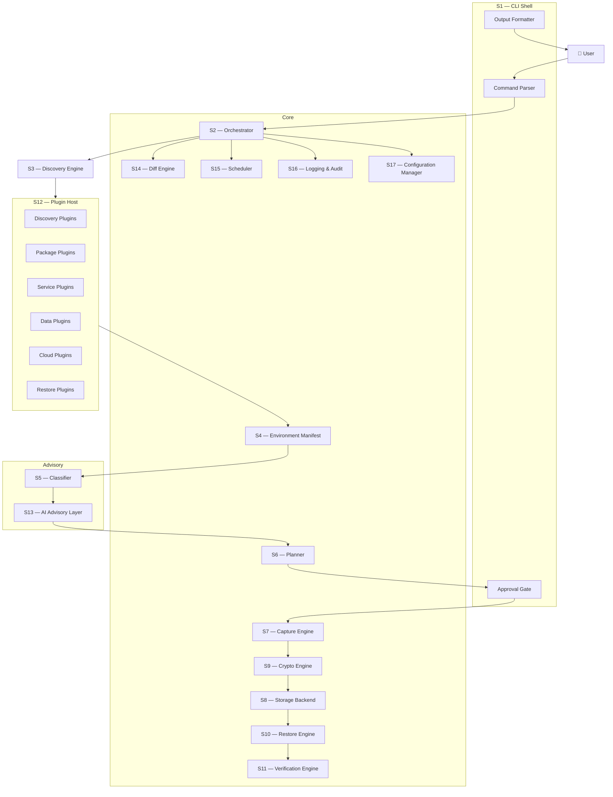
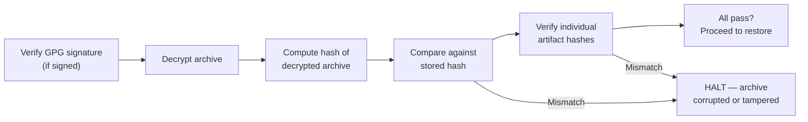
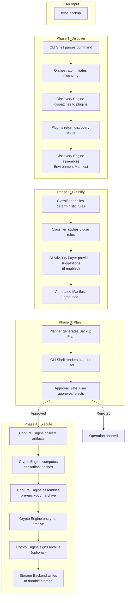
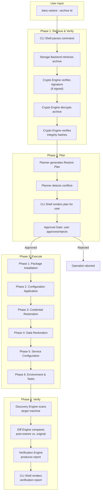
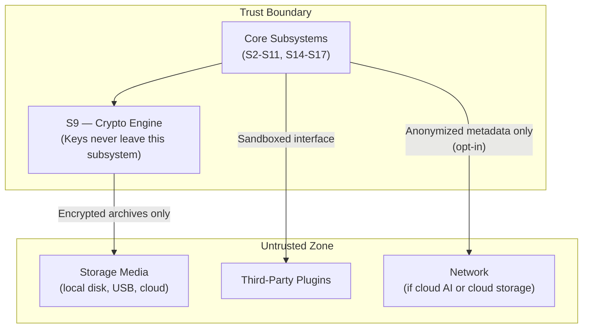

# Telos — System Architecture

> **Status:** Draft
> **Last Updated:** 2026-06-30
> **Owner:** temanhattan
> **Audience:** All future contributors, AI sessions, and design reviewers

---

## Table of Contents

1. [Architectural Overview](#architectural-overview)
2. [System Topology](#system-topology)
3. [Subsystem Index](#subsystem-index)
4. [Subsystem Definitions](#subsystem-definitions)
   - [S1 — CLI Shell](#s1--cli-shell)
   - [S2 — Orchestrator](#s2--orchestrator)
   - [S3 — Discovery Engine](#s3--discovery-engine)
   - [S4 — Environment Manifest](#s4--environment-manifest)
   - [S5 — Classifier](#s5--classifier)
   - [S6 — Planner](#s6--planner)
   - [S7 — Capture Engine](#s7--capture-engine)
   - [S8 — Storage Backend](#s8--storage-backend)
   - [S9 — Crypto Engine](#s9--crypto-engine)
   - [S10 — Restore Engine](#s10--restore-engine)
   - [S11 — Verification Engine](#s11--verification-engine)
   - [S12 — Plugin Host](#s12--plugin-host)
   - [S13 — AI Advisory Layer](#s13--ai-advisory-layer)
   - [S14 — Diff Engine](#s14--diff-engine)
   - [S15 — Scheduler](#s15--scheduler)
   - [S16 — Logging & Audit Subsystem](#s16--logging--audit-subsystem)
   - [S17 — Configuration Manager](#s17--configuration-manager)
5. [Data Flow — Backup Pipeline](#data-flow--backup-pipeline)
6. [Data Flow — Restore Pipeline](#data-flow--restore-pipeline)
7. [Plugin Boundary Contract](#plugin-boundary-contract)
8. [Security Perimeter](#security-perimeter)
9. [Failure Model](#failure-model)
10. [Cross-Cutting Concerns](#cross-cutting-concerns)
11. [Architectural Constraints](#architectural-constraints)
12. [Traceability to Vision](#traceability-to-vision)

---

## Architectural Overview

AERS is structured as a **pipeline-oriented, plugin-extended, CLI-driven** system. The architecture separates the invariant core — orchestration, security, storage, and verification — from the variant periphery — OS-specific discovery, package-manager integrations, and cloud adapters — through a formal plugin boundary.

The system follows three foundational architectural commitments:

1. **The core is small and stable.** It owns orchestration, cryptography, storage, verification, and the plugin contract. It contains zero OS-specific logic.
2. **All platform knowledge lives in plugins.** Every operating system, package manager, service supervisor, and cloud provider is represented by a plugin that implements a defined interface.
3. **Data flows through pipelines, not callbacks.** The backup and restore processes are linear, staged pipelines where each stage produces a well-defined output consumed by the next stage. There are no implicit event loops or hidden side channels.

---

## System Topology



---

## Subsystem Index

| ID | Subsystem | Layer | Stability | Description |
| ---- | ----------- | ------- | ----------- | ------------- |
| S1 | CLI Shell | Surface | Stable | User-facing command interface and output formatting |
| S2 | Orchestrator | Core | Stable | Pipeline coordinator; owns the lifecycle of every operation |
| S3 | Discovery Engine | Core | Stable | Dispatches discovery requests to plugins and aggregates results |
| S4 | Environment Manifest | Core | Stable | Canonical data model representing a discovered environment |
| S5 | Classifier | Intelligence | Evolving | Assigns roles, importance scores, and categories to manifest entries |
| S6 | Planner | Core | Stable | Generates human-reviewable backup and restore plans |
| S7 | Capture Engine | Core | Stable | Executes an approved backup plan, producing raw artifacts |
| S8 | Storage Backend | Core | Stable | Reads and writes backup archives to durable storage |
| S9 | Crypto Engine | Core | Stable | Encrypts, decrypts, hashes, signs, and verifies all artifacts |
| S10 | Restore Engine | Core | Stable | Executes an approved restore plan against a target machine |
| S11 | Verification Engine | Core | Stable | Validates post-restore environments against the original manifest |
| S12 | Plugin Host | Core | Stable | Manages plugin lifecycle: registration, validation, dispatch |
| S13 | AI Advisory Layer | Intelligence | Evolving | Provides non-binding suggestions to classification, planning, and anomaly detection |
| S14 | Diff Engine | Core | Stable | Compares two Environment Manifests and produces a structured diff |
| S15 | Scheduler | Core | Stable | Manages time-based triggers for automated backup operations |
| S16 | Logging & Audit | Cross-cutting | Stable | Structured, tamper-evident logging for all subsystem operations |
| S17 | Configuration Manager | Cross-cutting | Stable | Loads, validates, merges, and provides access to system and user configuration |

---

## Subsystem Definitions

---

### S1 — CLI Shell

**Layer:** Surface
**Stability:** Stable
**Depends on:** S2 (Orchestrator), S16 (Logging)
**Depended on by:** None (top-level entry point)

#### Purpose

The CLI Shell is the sole user-facing interface in the initial release. It translates human commands into orchestrator operations and formats subsystem outputs into human-readable terminal output. It also owns the **Approval Gate** — the critical checkpoint where destructive operations are presented to the user for explicit confirmation before execution.

#### Responsibilities

- Parse command-line arguments and subcommands.
- Validate user input before forwarding to the Orchestrator.
- Present backup and restore plans in a human-readable format.
- Implement the Approval Gate: display a plan summary, enumerate destructive actions, and block execution until the user explicitly confirms.
- Format progress indicators, status messages, error reports, and diff outputs for terminal display.
- Support output modes: interactive (with color, progress bars), plain (for piping), and JSON (for programmatic consumption).

#### Boundaries

- The CLI Shell **does not** contain business logic. It does not decide what to back up, how to encrypt, or where to store. It is a translation layer between the user and the Orchestrator.
- The CLI Shell **does not** directly invoke plugins, the Crypto Engine, or the Storage Backend.

#### Approval Gate Contract

The Approval Gate is the architectural enforcement of the vision principle *"Human Approval Before Destructive Operations."* Any operation that writes, modifies, or deletes data on the source or target machine must pass through this gate. The gate:

1. Receives a structured plan from the Planner (S6).
2. Renders the plan as a human-readable summary.
3. Highlights destructive operations with explicit warnings.
4. Blocks execution until the user provides one of: `approve`, `reject`, `modify`.
5. Returns the user's decision to the Orchestrator.

---

### S2 — Orchestrator

**Layer:** Core
**Stability:** Stable
**Depends on:** S1 (for user decisions), S3, S4, S5, S6, S7, S8, S9, S10, S11, S12, S14, S15, S16, S17
**Depended on by:** S1 (CLI Shell)

#### Purpose

The Orchestrator is the central coordinator of Telos. It owns the lifecycle of every high-level operation — discover, backup, restore, verify, diff, schedule — and is responsible for invoking subsystems in the correct order, passing data between pipeline stages, and handling errors at the operation level.

#### Responsibilities

- Define and enforce pipeline stage ordering for each operation type.
- Invoke subsystems sequentially according to the pipeline definition.
- Pass structured data between pipeline stages (e.g., the Environment Manifest from Discovery to the Classifier, the Plan from the Planner to the Approval Gate).
- Handle stage-level errors: decide whether to abort, retry, or present the failure to the user.
- Maintain operation-level state: track which stage is current, support resumption after interruption.
- Enforce the trust hierarchy: Human Decision > Deterministic Logic > AI Suggestion.

#### Boundaries

- The Orchestrator **does not** perform discovery, classification, encryption, or storage directly. It delegates to the responsible subsystem.
- The Orchestrator **does not** contain OS-specific logic. It is platform-agnostic.
- The Orchestrator **does not** make decisions that require human judgment. It routes those decisions to the CLI Shell's Approval Gate.

#### Pipeline Definitions

The Orchestrator defines the following top-level pipelines:

| Pipeline | Stages (in order) |
| ---------- | ------------------- |
| **Backup** | Discovery → Classification → Planning → Approval → Capture → Hashing → Encryption → Storage |
| **Restore** | Archive Retrieval → Decryption → Integrity Verification → Manifest Loading → Restore Planning → Approval → Execution → Post-Restore Verification |
| **Verify** | Discovery (current) → Manifest Loading (baseline) → Diff → Report |
| **Diff** | Manifest Loading (A) → Manifest Loading (B) → Diff → Report |
| **Discover** | Discovery → Classification → Report |

Each pipeline is a linear sequence. There are no branches, loops, or conditional forks within a pipeline. If a stage fails, the pipeline halts and reports the failure.

---

### S3 — Discovery Engine

**Layer:** Core
**Stability:** Stable
**Depends on:** S12 (Plugin Host), S16 (Logging)
**Depended on by:** S2 (Orchestrator), S4 (Manifest — as output target)

#### Purpose

The Discovery Engine is responsible for answering the question: *"What is on this machine?"* It does not answer the question directly — instead, it dispatches categorized discovery requests to registered plugins and aggregates their responses into a unified Environment Manifest.

#### Responsibilities

- Detect the host operating system family and version to determine which plugins are applicable.
- Query the Plugin Host for all registered discovery plugins compatible with the detected OS.
- Dispatch discovery requests to each applicable plugin in a defined category order.
- Aggregate plugin responses into a single, consistent Environment Manifest.
- Handle plugin failures gracefully: if a plugin fails, log the failure, mark the corresponding manifest section as incomplete, and continue with remaining plugins.
- Enforce read-only access: the Discovery Engine and its plugins must never modify the source system.

#### Discovery Categories

The Discovery Engine dispatches requests across the following categories, in order:

| Order | Category | What it discovers |
| ------- | ---------- | ------------------ |
| 1 | **Platform** | OS family, version, architecture, kernel, hostname, hardware profile |
| 2 | **Packages** | Installed packages across all detected package managers, with versions |
| 3 | **Services** | Running services/daemons, their configurations, and startup behavior |
| 4 | **User Configuration** | Dot files, shell configs, editor settings, desktop preferences |
| 5 | **Credentials** | SSH keys, GPG keys, API tokens, certificates (detected, not read — contents captured later under Credential Isolation) |
| 6 | **Environment** | Environment variables, PATH entries, shell aliases, shell functions |
| 7 | **Scheduled Tasks** | Cron jobs, systemd timers, Windows Task Scheduler entries |
| 8 | **Network** | Interface configs, DNS, VPN profiles, firewall rules, proxy settings |
| 9 | **Cloud Metadata** | Provider identity, instance metadata, attached roles/policies |
| 10 | **User Data** | User-designated directories and files marked for inclusion |

#### Boundaries

- The Discovery Engine **does not** interpret what it finds. Classification is the job of S5 (Classifier).
- The Discovery Engine **does not** decide what to back up. Planning is the job of S6 (Planner).
- The Discovery Engine **does not** contain any OS-specific logic. All platform knowledge is in plugins accessed through S12.

---

### S4 — Environment Manifest

**Layer:** Core
**Stability:** Stable
**Depends on:** None (passive data structure)
**Depended on by:** S2, S3, S5, S6, S7, S10, S11, S14

#### Purpose

The Environment Manifest is the canonical data model that represents a discovered environment. It is the single source of truth that flows through the entire pipeline — from discovery through classification, planning, capture, storage, and eventual restore.

#### Responsibilities

- Define a versioned, machine-readable schema for representing an environment.
- Store all discovery results in a structured, queryable format.
- Support annotations: each entry in the manifest can carry metadata added by the Classifier (role, importance, category, intent) and the AI Advisory Layer (suggestions, confidence scores).
- Support serialization to and deserialization from a portable format (JSON or equivalent).
- Include a schema version field to enable forward and backward compatibility.

#### Structure (Logical)

The manifest is organized into the following top-level sections, mirroring the discovery categories:

```
Environment Manifest
├── metadata
│   ├── schema_version
│   ├── created_at
│   ├── source_hostname
│   ├── telos_version
│   └── discovery_duration
├── platform
│   ├── os_family
│   ├── os_version
│   ├── architecture
│   ├── kernel
│   └── hardware_profile
├── packages[]
│   ├── manager (apt, winget, pip, etc.)
│   ├── name
│   ├── version
│   ├── source (repository URL)
│   ├── is_explicit (user-installed vs. dependency)
│   └── annotations{}
├── services[]
│   ├── name
│   ├── supervisor (systemd, windows-service, etc.)
│   ├── status (running, stopped, disabled)
│   ├── config_paths[]
│   └── annotations{}
├── user_config[]
│   ├── path
│   ├── type (dotfile, editor-config, shell-config, etc.)
│   ├── is_default (unchanged from OS default)
│   └── annotations{}
├── credentials[]
│   ├── type (ssh-key, gpg-key, api-token, certificate)
│   ├── path
│   ├── fingerprint (for keys)
│   └── annotations{}
├── environment[]
│   ├── scope (system, user)
│   ├── variable
│   ├── value
│   └── annotations{}
├── scheduled_tasks[]
│   ├── scheduler (cron, systemd-timer, task-scheduler)
│   ├── schedule_expression
│   ├── command
│   └── annotations{}
├── network
│   ├── interfaces[]
│   ├── dns_config
│   ├── vpn_profiles[]
│   ├── firewall_rules[]
│   └── annotations{}
├── cloud_metadata
│   ├── provider
│   ├── instance_id
│   ├── region
│   ├── attached_roles[]
│   └── annotations{}
└── user_data[]
    ├── path
    ├── size_bytes
    ├── last_modified
    ├── is_irreplaceable (true = must be backed up verbatim)
    └── annotations{}
```

#### Immutability Contract

Once the Discovery Engine produces a manifest, the manifest's **discovery data** is immutable. The Classifier and AI Advisory Layer may only add or modify **annotations** — they may never alter the discovered facts. This ensures that the raw discovery record is always preserved and auditable.

---

### S5 — Classifier

**Layer:** Intelligence
**Stability:** Evolving
**Depends on:** S4 (Manifest), S12 (Plugin Host — for classification rule plugins), S13 (AI Advisory Layer — optional)
**Depended on by:** S6 (Planner)

#### Purpose

The Classifier examines a completed Environment Manifest and answers the question: *"What does this environment mean?"* It assigns semantic labels — machine role, entry importance, backup category, and intent — to manifest entries. These annotations drive the Planner's decisions about what to include, exclude, and prioritize.

#### Responsibilities

- **Machine Role Classification:** Determine the overall role of the machine (e.g., developer workstation, web server, database server, cybersecurity lab, general desktop). The role is derived from the combination of installed packages, running services, and configuration patterns.
- **Entry Importance Scoring:** Assign an importance score to each manifest entry indicating how critical it is to environment reconstruction. Scores range from `critical` (must be captured) through `recommended`, `optional`, to `transient` (should be skipped).
- **Intent Annotation:** Where possible, annotate entries with their inferred intent (e.g., "reverse proxy," "Python virtual environment manager," "user shell customization").
- **Reproducibility Tagging:** Mark entries as `reproducible` (can be reinstalled from a public source) or `irreplaceable` (must be backed up verbatim because no external source exists).

#### Classification Hierarchy

```
Deterministic Rules  >  Plugin-Provided Rules  >  AI Suggestions
```

Classification operates in three tiers:

1. **Deterministic rules** (built into core): Known patterns that are always correct. Example: an SSH private key is always `critical` and `irreplaceable`.
2. **Plugin-provided rules**: OS-specific or domain-specific rules contributed by plugins. Example: an Ubuntu plugin knows that packages installed via `apt` from the default Ubuntu repository are `reproducible`.
3. **AI suggestions** (from S13): Probabilistic labels generated by the AI Advisory Layer. These are always tagged with a confidence score and are always overridable.

#### Boundaries

- The Classifier **does not** decide what to back up. It labels; the Planner decides.
- The Classifier **does not** modify discovery data. It only adds annotations.
- The Classifier **must function without AI.** If the AI Advisory Layer is disabled or unavailable, classification falls back to deterministic and plugin-provided rules with no loss of core functionality.

---

### S6 — Planner

**Layer:** Core
**Stability:** Stable
**Depends on:** S4 (Manifest — annotated), S5 (Classifier — annotations), S17 (Configuration Manager — user overrides)
**Depended on by:** S2 (Orchestrator), S7 (Capture Engine), S10 (Restore Engine)

#### Purpose

The Planner translates an annotated Environment Manifest into a concrete, human-reviewable plan — either a **Backup Plan** or a **Restore Plan**. The plan is the contract between the system and the user: it specifies exactly what will happen, in what order, and why.

#### Responsibilities

- **Backup Planning:** Generate a Backup Plan that lists every artifact to be captured, the method of capture (package name vs. file copy vs. config export), the estimated size contribution, and the reason for inclusion or exclusion.
- **Restore Planning:** Generate a Restore Plan that lists every action to be performed on the target machine — package installations, file restorations, configuration applications, service starts — in dependency-aware order.
- **Exclusion Reasoning:** For every manifest entry excluded from the plan, the Planner records the reason (e.g., "default configuration — unchanged from OS baseline," "reproducible from apt repository — name and version stored instead of binary").
- **Conflict Detection:** During restore planning, identify potential conflicts between the backup state and the target machine's current state (e.g., a package version that is no longer available, a config file that already exists).
- **User Override Integration:** Apply user-defined include/exclude rules from the Configuration Manager, overriding classifier annotations where the user has expressed an explicit preference.

#### Plan Structure (Logical)

```
Backup Plan
├── metadata
│   ├── plan_version
│   ├── created_at
│   ├── source_manifest_id
│   └── estimated_archive_size
├── actions[]
│   ├── action_id
│   ├── category (package, config, data, credential, service, etc.)
│   ├── method (reference | copy | export)
│   ├── source_path (if applicable)
│   ├── reason_for_inclusion
│   ├── estimated_size
│   ├── importance
│   └── credential_isolation (true/false)
├── exclusions[]
│   ├── manifest_entry_ref
│   └── reason_for_exclusion
└── warnings[]
    ├── warning_id
    ├── severity
    └── message
```

```
Restore Plan
├── metadata
│   ├── plan_version
│   ├── created_at
│   ├── target_os_family
│   └── source_manifest_id
├── phases[]
│   ├── phase_name (e.g., "packages", "configuration", "data", "services")
│   ├── phase_order
│   └── actions[]
│       ├── action_id
│       ├── type (install | copy | write | execute | start)
│       ├── target_path (if applicable)
│       ├── dependencies[] (action_ids that must complete first)
│       ├── rollback_action (what to do if this action fails)
│       ├── is_destructive (true/false)
│       └── requires_approval (true/false)
├── conflicts[]
│   ├── conflict_id
│   ├── description
│   └── suggested_resolution
└── warnings[]
    ├── warning_id
    ├── severity
    └── message
```

#### Boundaries

- The Planner **does not** execute any actions. It produces plans; execution is the job of S7 (Capture) and S10 (Restore).
- The Planner **does not** interact with the user directly. It emits a plan to the Orchestrator, which routes it through the CLI Shell's Approval Gate.

---

### S7 — Capture Engine

**Layer:** Core
**Stability:** Stable
**Depends on:** S6 (Planner — approved Backup Plan), S9 (Crypto Engine — for hashing), S12 (Plugin Host — for capture plugins), S16 (Logging)
**Depended on by:** S8 (Storage Backend)

#### Purpose

The Capture Engine executes an approved Backup Plan. It collects the specified artifacts from the source machine, computes integrity hashes for each artifact, and packages the results into a structured, pre-encryption archive.

#### Responsibilities

- Iterate through the approved Backup Plan's action list in order.
- For each action, invoke the appropriate capture method:
  - **Reference capture:** Record the package name, version, and source repository (no binary copied).
  - **File copy:** Read the file from the source path and include it in the archive.
  - **Config export:** Invoke a plugin-provided export function that serializes a service or application's configuration.
- Compute a SHA-256 hash for every captured artifact immediately after reading.
- Assemble the captured artifacts, the Environment Manifest, the Backup Plan, and the integrity hash manifest into a single structured archive.
- Handle partial capture failures: if an individual artifact cannot be captured (permission denied, file moved since discovery), log the failure, mark the entry in the archive as `capture_failed`, and continue with the remaining actions.
- Report progress to the Orchestrator for display through the CLI Shell.

#### Credential Isolation

Artifacts flagged with `credential_isolation: true` in the Backup Plan are captured into a separate, isolated segment of the archive. This segment is encrypted with a distinct key or passphrase (managed by S9) and is never co-mingled with general configuration data. The Capture Engine enforces this segregation at the structural level.

#### Boundaries

- The Capture Engine **does not** decide what to capture. It executes the approved plan exactly.
- The Capture Engine **does not** encrypt. It produces a plaintext archive that is then passed to the Crypto Engine.
- The Capture Engine **never modifies** the source system. It is strictly read-only.

---

### S8 — Storage Backend

**Layer:** Core
**Stability:** Stable
**Depends on:** S9 (Crypto Engine — receives encrypted archives), S16 (Logging), S17 (Configuration Manager — storage location)
**Depended on by:** S2 (Orchestrator), S10 (Restore Engine — retrieves archives)

#### Purpose

The Storage Backend is the subsystem responsible for writing backup archives to durable storage and retrieving them when needed for restore. It abstracts the physical storage medium behind a uniform interface.

#### Responsibilities

- Write encrypted backup archives to the configured storage location.
- Retrieve backup archives by identifier for the Restore Engine.
- List available backup archives with metadata (timestamp, source hostname, size, manifest summary).
- Manage storage lifecycle: retention policies, cleanup of expired archives, storage space monitoring.
- Support multiple storage backends through a provider abstraction:
  - **Local filesystem** (default): a directory on a local or mounted drive.
  - **External media:** USB drives, network-attached storage.
  - **Cloud storage** (future): S3, GCS, Azure Blob — implemented as storage plugins.
- Verify archive integrity on read: before returning an archive to the Restore Engine, confirm the archive's outer integrity hash matches.

#### Boundaries

- The Storage Backend **does not** encrypt or decrypt. It receives pre-encrypted archives from the Crypto Engine and returns them still encrypted.
- The Storage Backend **does not** understand the contents of archives. It treats them as opaque blobs with metadata.
- The Storage Backend **does not** make retention decisions autonomously. Retention policies are defined in user configuration and enforced deterministically.

---

### S9 — Crypto Engine

**Layer:** Core
**Stability:** Stable
**Depends on:** S17 (Configuration Manager — key configuration)
**Depended on by:** S7 (Capture Engine — hashing), S8 (Storage Backend — encryption/decryption), S10 (Restore Engine — decryption/verification)

#### Purpose

The Crypto Engine provides all cryptographic services for Telos. It is the single point of responsibility for encryption, decryption, hashing, signing, and verification. No other subsystem performs cryptographic operations directly.

#### Responsibilities

- **Hashing:** Compute SHA-256 hashes for individual artifacts during capture and for complete archives before storage.
- **Encryption:** Encrypt backup archives using AES-256 with a user-provided passphrase or key. Support distinct encryption for the credential-isolated segment.
- **Decryption:** Decrypt backup archives during restore, prompting for the passphrase or key through the CLI Shell.
- **Signing (optional):** Sign backup archives with a GPG key to provide non-repudiation and tamper evidence.
- **Verification:** Verify GPG signatures on archives. Verify integrity hash manifests against archive contents before restore.
- **Key derivation:** Derive encryption keys from user passphrases using a strong KDF (e.g., Argon2).

#### Integrity Verification Chain

The Crypto Engine enforces the following verification chain during restore:



If any verification step fails, the Crypto Engine reports the failure to the Orchestrator and the restore is halted. The system **never silently restores corrupted data.**

#### Boundaries

- The Crypto Engine **does not** store keys or passphrases persistently. It receives them at operation time and discards them when the operation completes.
- The Crypto Engine **does not** decide what to encrypt. It encrypts what it is given.
- The Crypto Engine **does not** transmit keys or passphrases over any network.

---

### S10 — Restore Engine

**Layer:** Core
**Stability:** Stable
**Depends on:** S6 (Planner — approved Restore Plan), S8 (Storage Backend — archive retrieval), S9 (Crypto Engine — decryption/verification), S12 (Plugin Host — restore plugins), S16 (Logging)
**Depended on by:** S11 (Verification Engine)

#### Purpose

The Restore Engine executes an approved Restore Plan against a target machine. It is the only subsystem authorized to write to the target system, and it does so strictly according to the approved plan.

#### Responsibilities

- Retrieve the backup archive from the Storage Backend.
- Invoke the Crypto Engine to decrypt and verify the archive.
- Execute the Restore Plan's phases in order, respecting dependency ordering within each phase.
- Delegate OS-specific restore actions to the appropriate plugins via the Plugin Host (e.g., `apt install` on Ubuntu, `winget install` on Windows).
- For each action, record the outcome (success, failure, skipped) in the operation log.
- Implement **checkpoint-based resumption:** after each successfully completed action, record a checkpoint. If the restore is interrupted, subsequent invocations can resume from the last checkpoint without re-executing completed actions.
- Implement **rollback on failure:** for each action, the Restore Plan specifies a rollback action. If an action fails and the user chooses not to continue, the Restore Engine can undo the actions completed in the current phase.

#### Restore Phases (Canonical Order)

| Phase | Actions | Rationale |
| ------- | --------- | ----------- |
| 1. Package Installation | Install packages via OS package managers | Packages must be installed before their configurations are applied |
| 2. Configuration Application | Write configuration files, dot files, shell configs | Configs depend on the packages they configure |
| 3. Credential Restoration | Restore SSH keys, GPG keys, API tokens (with separate decryption) | Credentials may be needed by services started in the next phase |
| 4. Data Restoration | Copy user data files and directories | Data is independent but may be large; placed late for UX (user can start working while data copies) |
| 5. Service Configuration | Apply service configurations and start services | Services depend on packages, configs, and possibly credentials |
| 6. Environment & Scheduled Tasks | Set environment variables, install cron jobs and timers | Final setup step; depends on everything above |

#### Boundaries

- The Restore Engine **does not** execute any action not present in the approved Restore Plan.
- The Restore Engine **does not** bypass the Approval Gate. If the Orchestrator presents a Restore Plan and the user rejects it, the Restore Engine is never invoked.
- The Restore Engine **does not** make best-effort guesses. If a required package is not available in the target's repositories, it reports the failure rather than substituting an alternative without user approval.

---

### S11 — Verification Engine

**Layer:** Core
**Stability:** Stable
**Depends on:** S3 (Discovery Engine — re-discovery of target), S4 (Manifest — original), S14 (Diff Engine)
**Depended on by:** S2 (Orchestrator)

#### Purpose

The Verification Engine answers the question: *"Does the restored environment match the original?"* It performs a post-restore discovery of the target machine and compares the result against the original Environment Manifest, producing a verification report.

#### Responsibilities

- Trigger a fresh discovery scan of the target machine using the Discovery Engine.
- Compare the post-restore manifest against the original manifest using the Diff Engine.
- Classify each difference as:
  - **Expected:** A known difference due to platform adaptation (e.g., different kernel version on newer hardware).
  - **Acceptable:** A minor difference that does not affect functionality (e.g., different package build number).
  - **Concerning:** A difference that may indicate an incomplete restore (e.g., a service not running that was running on the original).
  - **Critical:** A difference that indicates a restore failure (e.g., a package that failed to install, a credential that was not restored).
- Produce a structured Verification Report that the CLI Shell can render for the user.
- Return a pass/fail verdict based on configurable tolerance thresholds.

#### Boundaries

- The Verification Engine **does not** fix problems. It reports them. Remediation is a user decision, potentially triggering a new restore cycle.
- The Verification Engine **does not** require a perfect match. Functional equivalence within defined tolerances is the goal, not binary identity.

---

### S12 — Plugin Host

**Layer:** Core
**Stability:** Stable
**Depends on:** S16 (Logging), S17 (Configuration Manager — plugin paths)
**Depended on by:** S3 (Discovery Engine), S5 (Classifier), S7 (Capture Engine), S10 (Restore Engine)

#### Purpose

The Plugin Host manages the lifecycle of all plugins in Telos. It is the boundary between the stable core and the extensible ecosystem, providing registration, validation, execution, and capability dispatch for all plugin types.

#### Responsibilities

- **Registration:** Scan configured plugin directories and register all valid plugins at startup.
- **Validation:** Verify that each plugin implements the required interface for its declared type (discovery, capture, restore, classification, storage).
- **Capability Advertisement:** Maintain a registry of plugin capabilities (which OS families, which package managers, which cloud providers each plugin supports).
- **Dispatch:** Route requests from core subsystems to the appropriate plugin based on the current environment context (e.g., route package discovery to the `apt` plugin on Ubuntu, the `winget` plugin on Windows).
- **Isolation:** Ensure that a plugin failure (crash, timeout, invalid output) does not propagate to the core. Plugin failures are caught, logged, and reported as partial results.
- **Versioning:** Track plugin interface versions to ensure backward compatibility. Refuse to load plugins that target an incompatible interface version.

#### Plugin Types

| Type | Interface Provided To | Purpose |
| ------ | ---------------------- | --------- |
| **Discovery Plugin** | S3 (Discovery Engine) | Discover environment components for a specific OS, package manager, or service |
| **Classification Rule Plugin** | S5 (Classifier) | Provide OS-specific or domain-specific classification rules |
| **Capture Plugin** | S7 (Capture Engine) | Export configurations or data in a platform-specific manner |
| **Restore Plugin** | S10 (Restore Engine) | Execute restore actions in a platform-specific manner |
| **Storage Plugin** | S8 (Storage Backend) | Provide additional storage backends (cloud, network) |

#### Boundaries

- The Plugin Host **does not** implement any OS-specific logic itself. It is the framework; plugins are the content.
- The Plugin Host **does not** grant plugins direct access to other subsystems. Plugins interact with the core only through the defined plugin interface — they cannot bypass the Orchestrator, access the Crypto Engine, or write to storage directly.

---

### S13 — AI Advisory Layer

**Layer:** Intelligence
**Stability:** Evolving
**Depends on:** S4 (Manifest — as input), S17 (Configuration Manager — AI model paths, feature flags)
**Depended on by:** S5 (Classifier — optional), S6 (Planner — optional), S14 (Diff Engine — optional)

#### Purpose

The AI Advisory Layer provides non-binding, probabilistic suggestions to other subsystems. It is an **advisor**, not a decision-maker. Every suggestion it produces is tagged with a confidence score, accompanied by a human-readable rationale, and subject to override by deterministic logic and human decisions.

#### Responsibilities

- **Environment Classification Suggestions:** Suggest machine role labels based on patterns in the manifest (e.g., "this combination of nginx, certbot, and PostgreSQL suggests a web application server").
- **Importance Scoring Suggestions:** Suggest importance adjustments for manifest entries where deterministic rules are insufficient (e.g., a directory with frequent recent access that is not in any known convention).
- **Anomaly Flagging:** Compare a current manifest against a baseline and flag entries that are statistically unusual (e.g., a new SUID binary, an unexpected listening port).
- **Restore Conflict Prediction:** Predict which restore actions are likely to fail based on the delta between the source and target OS versions.
- **Reasoning Logging:** For every suggestion, produce a structured log entry explaining the input signals, the model's reasoning, and the confidence score.

#### Trust Boundaries

```
Human Decision  >  Deterministic Logic  >  AI Suggestion
```

The AI Advisory Layer is the **lowest-priority input** in every decision chain. Its outputs are always:

1. **Tagged:** Every suggestion carries `source: ai`, `confidence: float`, and `reasoning: string`.
2. **Optional:** Every subsystem that consumes AI suggestions has a codepath that functions identically without them.
3. **Overridable:** User configuration and deterministic rules always take precedence.

#### Operational Modes

| Mode | Behavior |
| ------ | ---------- |
| **Disabled** | AI layer is not loaded. All consuming subsystems use deterministic-only codepaths. |
| **Local** | AI inference runs on-device using a bundled or user-provided model. No network access. |
| **Cloud** (opt-in) | AI inference uses a cloud API. Never transmits backup contents or credentials. Transmits only anonymized manifest structure. |

#### Boundaries

- The AI Advisory Layer **never executes actions.** It produces suggestions that are consumed by other subsystems.
- The AI Advisory Layer **never accesses raw file contents.** It operates on manifest metadata only.
- The AI Advisory Layer **never transmits sensitive data.** Even in cloud mode, only anonymized structural metadata is sent.
- **Telos must be fully functional with the AI Advisory Layer disabled.**

---

### S14 — Diff Engine

**Layer:** Core
**Stability:** Stable
**Depends on:** S4 (Manifest — two instances to compare)
**Depended on by:** S2 (Orchestrator), S11 (Verification Engine)

#### Purpose

The Diff Engine compares two Environment Manifests and produces a structured, categorized diff report. It serves two primary use cases: **environment auditing** (comparing current state against a previous backup) and **post-restore verification** (comparing the restored environment against the original).

#### Responsibilities

- Accept two Environment Manifests as input (labeled "baseline" and "current").
- Compare each section of the manifests: platform, packages, services, configurations, credentials, environment variables, scheduled tasks, network, cloud metadata, user data.
- For each difference, produce a structured diff entry containing:
  - The manifest section.
  - The type of change: `added`, `removed`, `modified`.
  - The before and after values (for `modified` entries).
  - An optional severity classification (from the AI Advisory Layer, if enabled).
- Produce a summary report: total additions, removals, modifications by section.
- Support filtering: allow the caller to restrict the diff to specific sections or importance levels.

#### Boundaries

- The Diff Engine **does not** interpret the significance of differences. It reports structural differences. Interpretation (expected vs. concerning) is the Verification Engine's job during post-restore verification, or the user's job during auditing.
- The Diff Engine **does not** modify manifests. It is a pure read-only comparator.

---

### S15 — Scheduler

**Layer:** Core
**Stability:** Stable
**Depends on:** S2 (Orchestrator — to trigger backup pipelines), S17 (Configuration Manager — schedule definitions)
**Depended on by:** S2 (Orchestrator)

#### Purpose

The Scheduler manages time-based triggers for automated backup operations. It allows the user to configure recurring backup schedules so that backups happen without manual intervention.

#### Responsibilities

- Parse and validate schedule definitions from user configuration (cron-style expressions or human-readable intervals).
- Evaluate schedule triggers and invoke the Orchestrator's backup pipeline at the appropriate times.
- Record the last successful execution time for each schedule to support "run if missed" semantics (if the machine was off when a scheduled backup was due, run it when the machine next starts).
- Ensure that only one backup operation runs at a time per source machine. If a scheduled backup is triggered while another is in progress, queue it or skip it according to configuration.
- Integrate with OS-native scheduling mechanisms where appropriate (e.g., registering a systemd timer on Linux, a Task Scheduler entry on Windows) — implemented through plugins.

#### Boundaries

- The Scheduler **does not** execute backups itself. It invokes the Orchestrator's backup pipeline.
- The Scheduler **does not** bypass the Approval Gate for the initial setup. The first scheduled backup requires user approval of the plan. Subsequent runs of an unchanged plan may run unattended if the user has opted in to auto-approval for recurring schedules.
- The Scheduler **is optional.** Telos functions fully without scheduled backups; all operations can be triggered manually.

---

### S16 — Logging & Audit Subsystem

**Layer:** Cross-cutting
**Stability:** Stable
**Depends on:** None (leaf dependency)
**Depended on by:** All subsystems

#### Purpose

The Logging & Audit Subsystem provides structured, tamper-evident logging for every operation performed by every subsystem. It is the backbone of the vision principle *"Transparency Is Non-Negotiable."*

#### Responsibilities

- Provide a logging interface that all subsystems use to record operations, decisions, warnings, and errors.
- Support structured log entries with fields: timestamp, subsystem, operation, severity, message, and optional context.
- Write logs to a durable, append-only local log file.
- **Never log sensitive data.** The logging subsystem must never record passphrases, private keys, API tokens, or file contents. Sensitive paths are logged by basename only, never with content.
- Support log levels: `debug`, `info`, `warn`, `error`, `audit`.
- The `audit` level is reserved for security-critical events: encryption, decryption, approval decisions, credential access, archive verification outcomes.
- Produce machine-readable log output (JSON lines) in addition to human-readable output.

#### Audit Trail Guarantees

Every operation that involves data access, modification, or security decisions produces an `audit`-level log entry. The audit trail must support post-incident reconstruction of: *who* initiated an operation, *what* the operation did, *when* it occurred, *which* artifacts were affected, and *whether* it succeeded or failed.

#### Boundaries

- The Logging Subsystem **does not** make decisions based on log contents. It is a passive recorder.
- The Logging Subsystem **does not** transmit logs over a network. Logs are local. If future log aggregation is needed, it would be a separate subsystem.

---

### S17 — Configuration Manager

**Layer:** Cross-cutting
**Stability:** Stable
**Depends on:** None (leaf dependency, reads config files from filesystem)
**Depended on by:** S2, S5, S6, S8, S9, S12, S13, S15

#### Purpose

The Configuration Manager loads, validates, merges, and provides read-only access to all Telos configuration. It is the single source of truth for how Telos behaves on a given machine.

#### Responsibilities

- Load configuration from a defined hierarchy of sources, in priority order:
  1. **CLI flags** (highest priority — per-invocation overrides).
  2. **Environment variables** (session-level overrides via `TELOS_*`).
  3. **User configuration file** (persistent per-user settings, e.g., `~/.telos/config.yaml`).
  4. **System configuration file** (machine-wide defaults, e.g., `/etc/telos/config.yaml`).
  5. **Built-in defaults** (lowest priority — hardcoded sensible defaults).
- Merge configuration from all sources according to the priority hierarchy.
- Validate the merged configuration against a schema: reject unknown keys, enforce required fields, validate types and ranges.
- Provide a read-only configuration interface to all consuming subsystems.
- Support configuration introspection: the CLI Shell can display the effective merged configuration to help users understand why the system is behaving a certain way.

#### Configuration Domains

| Domain | Configurable Parameters |
| -------- | ------------------------ |
| **Storage** | Archive output directory, retention policy, storage backend selection |
| **Crypto** | Encryption algorithm, KDF parameters, GPG key ID for signing |
| **Discovery** | Plugin directories, discovery timeout, excluded paths |
| **Classification** | Custom importance overrides, user-defined include/exclude rules |
| **Scheduling** | Backup schedules, auto-approval for recurring schedules |
| **AI** | AI mode (disabled/local/cloud), model path, cloud API endpoint |
| **Logging** | Log level, log output path, audit log rotation |

#### Boundaries

- The Configuration Manager **does not** write configuration files. It is read-only. Configuration changes are made by the user directly.
- The Configuration Manager **does not** contain business logic. It loads and serves configuration; it does not interpret it.

---

## Data Flow — Backup Pipeline



---

## Data Flow — Restore Pipeline



---

## Plugin Boundary Contract

The plugin interface is the most important architectural boundary in Telos. It separates the stable core from the evolving ecosystem and must be designed for long-term stability.

### Principles

1. **Plugins are pure functions of their inputs.** A plugin receives a request and returns a response. It does not access global state, other subsystems, or other plugins.
2. **Plugins declare their capabilities.** At registration time, a plugin declares which OS families, package managers, or cloud providers it supports, and which plugin types it implements.
3. **Plugins are versioned.** Each plugin declares the plugin interface version it targets. The Plugin Host refuses to load plugins targeting an incompatible version.
4. **Plugins fail safely.** A plugin crash, timeout, or malformed response results in a logged error and a `partial` result in the manifest — never a core crash.
5. **Plugins are sandboxed.** Plugins cannot access the filesystem outside their declared scope, cannot make network requests unless explicitly authorized, and cannot invoke other subsystems.

### Interface Summary

| Plugin Type | Input | Output |
| ------------ | ------- | -------- |
| Discovery | OS context + discovery category | List of discovered entries for the manifest |
| Classification Rule | Manifest entry | Importance score + annotations |
| Capture | Backup Plan action + source path | Captured artifact bytes or export data |
| Restore | Restore Plan action + target context | Execution result (success/failure/rollback) |
| Storage | Archive bytes + metadata | Storage confirmation or retrieval response |

---

## Security Perimeter



**Key security invariants:**

1. **Plaintext backup data never crosses the trust boundary.** Archives are encrypted before they reach storage media.
2. **Encryption keys never leave the Crypto Engine.** Other subsystems request cryptographic operations; they do not receive raw keys.
3. **Plugins operate within a sandbox.** They cannot access subsystems, storage, or cryptographic material directly.
4. **Credentials are double-encrypted.** The credential-isolated segment uses a separate key from the main archive.
5. **Network communication is opt-in and metadata-only.** No backup content or credentials are ever transmitted.

---

## Failure Model

Telos is designed so that failures are **bounded, recoverable, and transparent.**

| Failure Scenario | Affected Subsystem | System Behavior |
| ----------------- | ------------------- | ---------------- |
| Plugin crashes during discovery | S3, S12 | Log error. Mark the plugin's manifest section as `incomplete`. Continue with other plugins. Present incomplete manifest to user with warnings. |
| File permission denied during capture | S7 | Log error for the specific artifact. Mark as `capture_failed` in archive. Continue with remaining artifacts. Report in summary. |
| Encryption failure | S9 | Halt immediately. No partial archive is written to storage. Report error to user. |
| Storage write failure | S8 | Halt immediately. Archive remains in local staging. Report error with storage diagnostics. |
| Integrity verification failure during restore | S9 | Halt immediately. No restore actions are executed. Report which artifacts failed verification. |
| Package installation failure during restore | S10 | Log the failure. Record checkpoint. Offer user choices: skip, retry, rollback phase, abort. |
| Restore interrupted (power loss, crash) | S10 | On next invocation, detect the checkpoint file. Offer to resume from the last successful action. |
| AI Advisory Layer unavailable | S13 | Silently fall back to deterministic-only classification and planning. No loss of core functionality. |
| Configuration file malformed | S17 | Refuse to start. Report the specific validation error with the file path and line number. |

---

## Cross-Cutting Concerns

### Concurrency

Telos is designed as a **single-threaded, sequential pipeline** in its initial architecture. Each operation (backup, restore, verify) runs as a single linear process. There is no concurrent access to the manifest, archive, or storage. This simplifies reasoning about correctness, especially for cryptographic operations and file access.

Future optimization may introduce parallelism within specific stages (e.g., parallel file hashing during capture), but never across pipeline stages.

### Idempotency

Restore operations should be **idempotent within a phase.** Re-running a restore phase that has already completed should detect the existing state and skip already-applied actions without producing errors or duplicates.

### Portability

The core subsystems (S2, S4, S6, S9, S14, S16, S17) contain **zero platform-specific code.** All platform-specific behavior is implemented in plugins and accessed through the Plugin Host. The core must compile and run on any platform supported by the chosen implementation language.

### Extensibility Points

The architecture defines four formal extensibility points. All extension happens through these points — never by modifying core subsystem code.

| Extensibility Point | Mechanism | Example |
| --------------------- | ----------- | --------- |
| New OS support | Discovery + Restore plugins | Add Fedora support by writing an `rpm`/`dnf` discovery plugin and restore plugin |
| New package manager | Discovery + Capture + Restore plugins | Add Homebrew support for macOS |
| New storage backend | Storage plugin | Add S3 support by writing an S3 storage plugin |
| New classification rules | Classification Rule plugin | Add Docker-aware classification rules |

---

## Architectural Constraints

The following constraints are **non-negotiable** and must be preserved across all future design decisions:

| # | Constraint | Rationale | Vision Traceability |
| --- | ----------- | ----------- | ------------------- |
| 1 | The core contains zero OS-specific logic. | Ensures the plugin architecture is real, not aspirational. | *Modular Plugin Architecture* |
| 2 | No backup data is stored in plaintext outside the source machine. | Zero-trust security model. | *Zero Trust* |
| 3 | Every destructive operation passes through the Approval Gate. | Human authority over automation. | *Human Approval Before Destructive Operations* |
| 4 | The system is fully functional with AI disabled. | AI is advisory, not foundational. | *The system works without AI* |
| 5 | Pipelines are linear and sequential. No hidden side effects. | Deterministic restore guarantee. | *Deterministic Restore* |
| 6 | Plugin failures are isolated and never crash the core. | System resilience. | *Failures Must Be Recoverable* |
| 7 | The Environment Manifest's discovery data is immutable after creation. | Audit integrity. | *Transparency Is Non-Negotiable* |
| 8 | Credentials receive a higher tier of protection than general data. | Defense in depth. | *Credential Isolation* |
| 9 | All operations function fully offline. | Offline-first principle. | *Offline-First* |
| 10 | Log entries never contain sensitive data. | Security-by-default logging. | *Auditability* |

---

## Traceability to Vision

Every subsystem in this architecture is traceable to one or more principles defined in [00_Vision.md]:

| Vision Principle | Implementing Subsystems |
| ----------------- | ------------------------ |
| Discovery Before Backup | S3 (Discovery Engine), S4 (Manifest), S5 (Classifier) |
| Intent Over Artifacts | S5 (Classifier), S13 (AI Advisory Layer) |
| Minimum Backup Size, Maximum Recoverability | S6 (Planner) — reference capture over file copy |
| Deterministic Restore | S2 (Orchestrator) — linear pipelines, S10 (Restore Engine) — ordered phases |
| Modular Plugin Architecture | S12 (Plugin Host) — plugin boundary contract |
| Human Approval Before Destructive Operations | S1 (CLI Shell) — Approval Gate |
| Comprehension Precedes Action | S3 → S5 → S6 pipeline: discover, classify, then plan |
| Transparency Is Non-Negotiable | S16 (Logging & Audit), S6 (Planner) — exclusion reasoning |
| Security Is the Foundation | S9 (Crypto Engine), S7 (Capture Engine) — credential isolation |
| Failures Must Be Recoverable | S10 (Restore Engine) — checkpoint-based resumption and rollback |
| Simplicity Over Cleverness | Sequential pipelines, no concurrency in initial design |
| Convention Over Configuration | S17 (Configuration Manager) — built-in defaults as lowest priority |
| Offline-First | All core subsystems operate without network access |

---

> **This document defines the structural skeleton of Telos.** Every subsystem, every boundary, and every data flow described here must be reflected in the implementation. If future implementation decisions conflict with this architecture, the conflict should be resolved explicitly — either by updating the implementation or by amending this document through a formal review.
