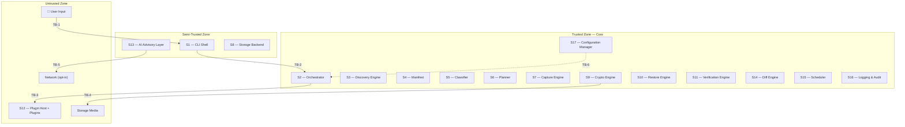

# AERS — Security Threat Model

> **Status:** Draft
> **Last Updated:** 2026-07-01
> **Owner:** temanhattan
> **Audience:** All future contributors, AI sessions, and design reviewers
> **Source of Truth:** [00_Vision.md](00_Vision.md), [01_Requirements.md](01_Requirements.md), [02_Architecture.md](02_Architecture.md), [05_Plugin_API.md](05_Plugin_API.md)

---

## Table of Contents

1. [Purpose](#1-purpose)
2. [Security Objectives](#2-security-objectives)
3. [Assets](#3-assets)
4. [Trust Boundaries](#4-trust-boundaries)
5. [Threat Actors](#5-threat-actors)
6. [Attack Surfaces](#6-attack-surfaces)
7. [Threat Analysis (STRIDE)](#7-threat-analysis-stride)
8. [Security Assumptions](#8-security-assumptions)
9. [Security Principles](#9-security-principles)
10. [Security Requirements Traceability](#10-security-requirements-traceability)
11. [Future Security Improvements](#11-future-security-improvements)

---

## 1. Purpose

This document defines the comprehensive security threat model for AERS — the Adaptive Environment Recovery System.

AERS operates on some of the most sensitive data a computing environment contains: encryption keys, SSH private keys, GPG secret keys, API tokens, database passwords, personal configuration, and irreplaceable user data. It captures this data, packages it into portable archives, and stores those archives on media that may be physically transportable or network-accessible. A security failure in AERS does not merely leak a file — it can expose the full identity and access surface of every machine in the user's fleet.

This threat model exists to:

- **Identify** every significant asset that AERS must protect.
- **Map** the trust boundaries within and around the system.
- **Enumerate** the threat actors, attack surfaces, and threat scenarios the architecture must defend against.
- **Evaluate** the existing mitigations provided by the architecture and identify residual risks.
- **Guide** future implementation decisions by establishing security priorities and tradeoff rationales.

This document analyzes the architecture as defined in the source-of-truth documents listed above. It does not redesign the architecture, introduce new features, or prescribe implementation-level details. It is a security analysis instrument, not a design document.

---

## 2. Security Objectives

AERS defines the following primary security objectives, ordered by priority. When security objectives conflict, higher-priority objectives take precedence.

| Priority | Objective | Definition |
|----------|-----------|------------|
| 1 | **Confidentiality** | Backup archives, credentials, and sensitive configuration data must be protected from unauthorized disclosure at rest, in transit between subsystems, and during staging. No backup data may exist in plaintext outside the source machine's volatile memory during active operation. |
| 2 | **Integrity** | Backup archives must be tamper-evident. Any modification — accidental or deliberate — to an archive after creation must be detectable before restore. The system must never silently restore corrupted or tampered data. |
| 3 | **Authenticity** | The system must verify that a backup archive was produced by a legitimate AERS instance and has not been substituted. Optional digital signing provides non-repudiation and origin verification. |
| 4 | **Privacy** | The system must minimize exposure of sensitive metadata. Logs must never contain secrets. AI cloud communication must transmit only anonymized structural metadata. Credential file paths are logged by basename only. |
| 5 | **Availability** | The system must remain operational offline and tolerate partial failures without total loss of functionality. Plugin failures, discovery failures, and storage interruptions must not prevent the system from functioning at reduced capacity. |
| 6 | **Non-repudiation** | When archives are digitally signed, it must be possible to verify that a specific user produced a specific archive at a specific time. Audit logs must record all security-critical decisions with sufficient detail for post-incident reconstruction. |
| 7 | **Recoverability** | Interrupted restore operations must be resumable without corruption or duplication. The system must support checkpoint-based recovery and phase-level rollback. Partial failure must never produce an inconsistent state on the target machine. |

---

## 3. Assets

The following assets require protection. Each asset is classified by sensitivity and the primary security objective it demands.

### 3.1 Critical Assets

| Asset | Description | Primary Objective | Sensitivity |
|-------|-------------|-------------------|-------------|
| **Credential materials** | SSH private keys, GPG secret keys, API tokens, certificates, database passwords captured under credential isolation. | Confidentiality | **Highest** — compromise grants access to external systems, repositories, and services. |
| **Master passphrase** | The user-provided passphrase from which all encryption keys are derived. Exists only in volatile memory during operation. | Confidentiality | **Highest** — compromise exposes all backup archives. |
| **Derived encryption keys** | Cryptographic keys derived from the master passphrase via KDF. Exist only in volatile memory during operation. | Confidentiality | **Highest** — compromise exposes the archive or credential segment they protect. |
| **Backup archives** | Encrypted, integrity-verified containers holding the complete reconstructable state of an environment. | Confidentiality, Integrity | **Highest** — contain everything needed to reconstruct the user's identity and environment. |

### 3.2 High-Sensitivity Assets

| Asset | Description | Primary Objective | Sensitivity |
|-------|-------------|-------------------|-------------|
| **Environment Manifest** | Structured description of a discovered environment: installed packages, services, configurations, network settings, credential locations. | Confidentiality, Integrity | **High** — reveals the complete attack surface of the source machine. |
| **Local encrypted manifest cache** | Encrypted copies of Environment Manifests stored locally for efficient comparison. | Confidentiality, Integrity | **High** — cache of manifest data; encrypted at rest. |
| **User configuration** | Shell configurations, editor settings, dot files, environment variables. May contain embedded secrets. | Confidentiality | **High** — may inadvertently contain API keys, tokens, or passwords in environment variables or shell configs. |
| **Backup and Restore Plans** | Detailed descriptions of what will be captured or restored, including file paths, package lists, and credential flags. | Integrity, Privacy | **High** — reveals the structure and contents of the environment. |
| **GPG signing key** | Optional key used to sign backup archives for non-repudiation. | Confidentiality, Integrity | **High** — compromise enables forged archive signatures. |

### 3.3 Medium-Sensitivity Assets

| Asset | Description | Primary Objective | Sensitivity |
|-------|-------------|-------------------|-------------|
| **Plugin packages** | Executable code loaded and run by the Plugin Host. Official, community, and unsigned trust tiers. | Integrity, Authenticity | **Medium** — malicious plugins execute within the sandbox but may attempt privilege escalation. |
| **AERS configuration files** | User and system configuration files controlling AERS behavior: storage paths, encryption parameters, plugin directories, trust policies. | Integrity | **Medium** — manipulation can weaken security posture (e.g., enabling unsigned plugins, changing storage locations). |
| **Audit logs** | Structured, append-only records of all operations, decisions, and security events. | Integrity, Availability | **Medium** — tampering hides evidence of attack; deletion removes accountability. |
| **Verification and Diff Reports** | Structured comparisons of environments before and after operations. | Integrity | **Medium** — falsification could mask incomplete or compromised restores. |
| **Restore checkpoints** | State markers enabling resumption of interrupted restore operations. | Integrity | **Medium** — corruption could cause re-execution of destructive actions or skip required steps. |

### 3.4 Informational Assets

| Asset | Description | Primary Objective | Sensitivity |
|-------|-------------|-------------------|-------------|
| **Approval decisions** | Records of user approval or rejection of execution plans. | Non-repudiation | **Low** — recorded in audit logs; informational value for accountability. |
| **AI advisory suggestions** | Non-binding classification and conflict predictions with confidence scores. | Integrity | **Low** — manipulation could mislead but cannot bypass deterministic logic or approval gates. |
| **Plugin capability registry** | In-memory index of registered plugin capabilities. | Availability | **Low** — reconstructed at startup from plugin manifests. |

---

## 4. Trust Boundaries

The AERS architecture defines the following trust boundaries. Data crossing a trust boundary requires explicit security controls.

### 4.1 Trust Boundary Map

### 4.2 Trust Boundary Definitions

| ID | Boundary | Data Crossing | Security Controls |
|----|----------|---------------|-------------------|
| **TB-1** | User ↔ CLI Shell | Commands, passphrases, approval decisions. | Input validation, command parsing, passphrase handling in volatile memory only. |
| **TB-2** | CLI Shell ↔ Core (Orchestrator) | Parsed commands, user decisions, formatted outputs. | CLI contains no business logic. Orchestrator validates all inputs. Approval Gate enforces human authority. |
| **TB-3** | Core ↔ Plugins | Discovery requests, capture requests, restore requests, plugin responses. | Subprocess isolation, sandbox enforcement, permission declaration and enforcement, timeout enforcement, response schema validation, trust verification, signature validation. |
| **TB-4** | Crypto Engine ↔ Storage Media | Encrypted backup archives only. | All data encrypted before crossing this boundary. Integrity hashes computed before encryption. Verification performed after retrieval and decryption. |
| **TB-5** | AI Advisory Layer ↔ Network | Anonymized structural metadata only (cloud mode, opt-in). | No backup contents, credentials, or identifiable paths transmitted. Cloud mode is opt-in; default is local-only. |
| **TB-6** | Configuration ↔ Runtime | Configuration values from files, environment variables, and CLI flags. | Schema validation, type checking, unknown key rejection. Malformed configuration halts startup. |
| **TB-7** | Source Machine ↔ Backup Archive | All discoverable environment state. | Encryption, integrity hashing, optional signing. Credential isolation with separate key material. |
| **TB-8** | Backup Archive ↔ Target Machine | All restoreable environment state. | Signature verification, decryption, integrity verification, Approval Gate, phased execution, checkpoint-based resumption. |

---

## 5. Threat Actors

The following threat actors represent plausible adversaries against an AERS deployment. Each actor is characterized by capability, motivation, and access level.

| ID | Actor | Capability | Motivation | Access |
|----|-------|-----------|------------|--------|
| **TA-1** | **Malware on host** | Moderate to high. Runs with user or elevated privileges on the source or target machine. | Exfiltrate credentials, inject backdoors, persist across rebuilds. | Local filesystem access, process memory access, ability to read/modify files owned by the user. |
| **TA-2** | **Malicious plugin** | Moderate. Operates within the plugin sandbox but may attempt escape. | Exfiltrate data during capture or restore, inject persistent backdoors into restored environments, tamper with discovery results. | Plugin subprocess permissions, declared filesystem scope, declared subprocess list. |
| **TA-3** | **Stolen storage media** | Low to moderate. Possesses a USB drive, external disk, or NAS share containing backup archives. | Extract credentials, personal data, and environment information from offline archives. | Physical or network access to encrypted backup archives. No access to the source machine or passphrase. |
| **TA-4** | **Insider (curious user)** | Low. Has legitimate access to the machine but not to AERS backups. | Browse backup contents out of curiosity or opportunism. | Local filesystem access. No passphrase knowledge. |
| **TA-5** | **Remote attacker** | Moderate to high. Network-based attacker targeting cloud storage, AI cloud endpoints, or network-attached storage. | Intercept or exfiltrate backup data, inject tampered archives, conduct man-in-the-middle attacks. | Network access to storage endpoints or AI cloud APIs. |
| **TA-6** | **Supply chain attacker** | High. Compromises the plugin distribution chain, plugin signing keys, or AERS dependencies. | Distribute trojanized plugins, compromise the integrity of the plugin trust chain. | Ability to produce signed or plausible plugin packages that pass trust verification. |
| **TA-7** | **Physical attacker** | Low. Has brief physical access to the source or target machine. | Extract passphrase from running process memory, copy staging files, tamper with configuration. | Physical access to an unlocked machine. |

---

## 6. Attack Surfaces

Each attack surface represents a point where a threat actor can interact with or influence the system.

### AS-1: Plugin Loading and Execution

**Entry point:** Plugin Host (S12) scans configured directories, loads manifests, and spawns plugin subprocesses.

**Attack vectors:**
- Placing a malicious plugin in a configured plugin directory.
- Replacing a legitimate plugin package with a trojanized version.
- Exploiting sandbox weaknesses to escape declared permission scope.
- Returning crafted malformed responses to trigger parsing vulnerabilities in the Plugin Host.
- Declaring overly broad permissions that the Plugin Host accepts.

**Existing controls:** Trust model (Official/Community/Unsigned), signature verification, sandbox enforcement, permission declaration and validation, response schema validation, process isolation, timeout enforcement.

---

### AS-2: Configuration

**Entry point:** Configuration Manager (S17) reads from user configuration files, system configuration files, environment variables, and CLI flags.

**Attack vectors:**
- Modifying the user or system configuration file to weaken security (e.g., enabling unsigned plugins, changing storage location to attacker-controlled path, disabling AI safety constraints).
- Injecting malicious values through environment variables.
- Manipulating the plugin directory path to point to attacker-controlled directories.
- Altering KDF parameters to weaken key derivation.

**Existing controls:** Schema validation, type enforcement, unknown key rejection, configuration priority hierarchy, startup halt on validation failure.

---

### AS-3: Restore Process

**Entry point:** Restore Engine (S10) executes an approved Restore Plan on the target machine.

**Attack vectors:**
- Injecting a tampered backup archive that passes signature checks (if signing key is compromised).
- Exploiting a restore plugin to write to paths outside its declared scope.
- Manipulating checkpoint files to cause re-execution of destructive actions or skip security-critical steps.
- Supplying a valid but backdoored archive (e.g., modified configuration files that include attacker-controlled services, cron jobs, or SSH authorized keys).

**Existing controls:** Integrity verification chain (signature → decryption → hash verification → individual artifact hash verification), Approval Gate, phased execution, dependency ordering, checkpoint-based resumption, rollback on failure, idempotent actions, restore plugins report all changes.

---

### AS-4: Backup Archive (At Rest)

**Entry point:** Encrypted archives stored on local filesystem, external media, or network-attached storage.

**Attack vectors:**
- Offline brute-force attack against the master passphrase.
- Side-channel attacks during encryption/decryption.
- Copying archives from unattended storage media.
- Replacing a legitimate archive with a tampered one.
- Analyzing archive metadata (file size, timestamp patterns) for information leakage.

**Existing controls:** AES-256 encryption, strong KDF (Argon2) for key derivation, SHA-256 integrity hashes, optional GPG signing, credential isolation with separate key material.

---

### AS-5: Storage Backend

**Entry point:** Storage Backend (S8) writes and reads encrypted archives to/from durable storage.

**Attack vectors:**
- Compromising cloud storage credentials (for future cloud storage plugins).
- Man-in-the-middle attacks on network storage connections.
- Storage backend plugin returning a modified archive during read operations.
- Denial of service through storage exhaustion.

**Existing controls:** Archives are encrypted before reaching storage. Storage Backend treats archives as opaque blobs. Integrity verification on retrieval. Storage plugins operate on encrypted data only.

---

### AS-6: CLI Interface

**Entry point:** CLI Shell (S1) accepts user commands and passphrases.

**Attack vectors:**
- Shoulder surfing or keylogging during passphrase entry.
- Shell history capturing passphrases passed as command-line arguments.
- Piping attacks substituting approval responses to bypass the Approval Gate.
- Terminal escape sequence injection in output.

**Existing controls:** CLI contains no business logic. Approval Gate requires explicit user response. Passphrases handled in volatile memory only.

---

### AS-7: Environment Discovery

**Entry point:** Discovery Engine (S3) dispatches read-only scans of the source machine through plugins.

**Attack vectors:**
- A compromised source machine presenting false discovery results to embed backdoors in the backup.
- Discovery plugins reading credential file contents during discovery (violating the behavioral contract).
- TOCTOU (time-of-check-time-of-use) attacks where files change between discovery and capture.

**Existing controls:** Discovery is read-only. Credential discovery detects location and type only — never reads contents. Plugin behavioral contracts. Manifest immutability after creation.

---

### AS-8: Secrets Handling

**Entry point:** Master passphrase entry, key derivation, credential isolation segment, in-memory key handling.

**Attack vectors:**
- Memory dumping to extract passphrase or derived keys from process memory.
- Swap file or hibernation file containing memory contents with key material.
- Core dump files including cryptographic material.
- Passphrase persistence through shell history or environment variables.

**Existing controls:** Keys and passphrases are not stored persistently (NFR-1.7). Keys are received at operation time and discarded on completion. Keys are never transmitted over the network (NFR-1.8). Logs never contain sensitive data.

---

### AS-9: Audit Logs

**Entry point:** Logging & Audit Subsystem (S16) writes structured logs to append-only local storage.

**Attack vectors:**
- Tampering with or deleting log files to hide evidence of attack.
- Injecting false log entries to create alibi.
- Exploiting log parsing to inject malicious payloads (log injection).

**Existing controls:** Append-only storage. Structured log format. Logs never contain sensitive data. Audit-severity logging for security-critical events.

---

### AS-10: AI Advisory Layer

**Entry point:** AI Advisory Layer (S13) processes manifest metadata and optionally communicates with cloud APIs.

**Attack vectors:**
- Adversarial manipulation of manifest data to bias AI suggestions (e.g., causing AI to classify a backdoor as benign).
- Interception of cloud AI communications to extract anonymized metadata.
- AI model poisoning if user-provided or community models are used.

**Existing controls:** AI is advisory only — never executes actions. Trust hierarchy (Human > Deterministic > AI). All AI suggestions are overridable. Cloud mode is opt-in. Only anonymized structural metadata is transmitted. System is fully functional with AI disabled.

---

## 7. Threat Analysis (STRIDE)

Threats are organized using the STRIDE classification framework. Each threat is assigned a unique identifier, evaluated for impact and likelihood, and mapped to existing mitigations and residual risk.

**Risk Level Matrix:**

| | Low Impact | Medium Impact | High Impact | Critical Impact |
|--|-----------|---------------|-------------|-----------------|
| **High Likelihood** | Medium | High | Critical | Critical |
| **Medium Likelihood** | Low | Medium | High | Critical |
| **Low Likelihood** | Low | Low | Medium | High |

---

### 7.1 Spoofing

Threats where an attacker impersonates a legitimate entity.

| ID | Threat | Impact | Likelihood | Risk | Existing Mitigations | Residual Risk |
|----|--------|--------|-----------|------|---------------------|---------------|
| S-01 | **Spoofed plugin.** An attacker places a malicious plugin in a configured plugin directory that impersonates a legitimate plugin. | **Critical** — malicious code executes during discovery, capture, or restore with declared permissions. | Medium | **Critical** | Plugin signature verification. Trust model (Official/Community/Unsigned). Unsigned plugins disabled by default. Community plugins require explicit user approval. Manifest validation and interface version checks. | If the attacker gains write access to plugin directories and can produce a validly signed package (supply chain compromise), spoofed plugins may pass verification. Residual risk is **medium** against supply chain attacks. |
| S-02 | **Spoofed backup archive.** An attacker substitutes a legitimate backup archive with a crafted one containing backdoored configurations. | **Critical** — restoring a spoofed archive installs attacker-controlled services, credentials, or cron jobs on the target machine. | Low | **High** | Integrity hash manifest verified before restore. Optional GPG signature verification. Approval Gate presents the full restore plan for user review. | If the archive is not signed (signing is optional), the attacker need only match the encryption format. If signed, the attacker must also compromise the signing key. Residual risk is **medium** without signing, **low** with signing. |
| S-03 | **Spoofed configuration source.** An attacker modifies environment variables or configuration files to inject malicious settings. | **High** — can redirect storage, weaken encryption, enable unsigned plugins, or alter plugin paths. | Medium | **High** | Configuration schema validation. Priority hierarchy (CLI > env vars > user config > system config > defaults). Startup halt on validation failure. | Schema validation catches structurally invalid configuration but may not detect semantically malicious but syntactically valid values (e.g., a valid path pointing to an attacker-controlled directory). Residual risk is **medium**. |

---

### 7.2 Tampering

Threats where an attacker modifies data without authorization.

| ID | Threat | Impact | Likelihood | Risk | Existing Mitigations | Residual Risk |
|----|--------|--------|-----------|------|---------------------|---------------|
| T-01 | **Tampered backup archive.** An attacker modifies an encrypted archive on storage media — flipping bits, truncating data, or performing controlled modifications. | **High** — if undetected, corrupted data is restored to the target machine. | Medium | **High** | SHA-256 integrity hashes for every artifact. Hash manifest verified before restore. Archive-level integrity hash verified on retrieval. Optional GPG signature. | The integrity verification chain provides strong detection. If all verification passes, tampering is detected. Residual risk is **low** — limited to implementation defects in the verification chain itself. |
| T-02 | **Tampered Environment Manifest.** An attacker or malicious plugin modifies the manifest to inject false discovery data. | **High** — false manifest entries lead to incorrect backup plans (missing critical data) or incorrect restore plans (installing unwanted software). | Low | **Medium** | Manifest immutability contract (discovery data is frozen after creation). Classifier and AI may only add annotations. Manifest stored inside encrypted archive. | Immutability is an architectural contract enforced at the design level. A compromised core could bypass it. Residual risk is **low** — requires core compromise. |
| T-03 | **Tampered audit logs.** An attacker modifies or deletes log files to conceal unauthorized operations. | **Medium** — loss of accountability and forensic evidence. | Medium | **Medium** | Append-only log storage. Structured log format. | Append-only is a design constraint, not a cryptographic guarantee. An attacker with filesystem write access to the log directory can modify or delete log files. Residual risk is **medium** — mitigated in future by cryptographic log chaining. |
| T-04 | **Tampered restore checkpoints.** An attacker modifies checkpoint state to cause the Restore Engine to skip steps or re-execute destructive actions. | **High** — may cause inconsistent target state, bypassed security configurations, or duplicate destructive operations. | Low | **Medium** | Checkpoint recorded after each successful action. Restore phases are idempotent. Rollback specified per action. | Checkpoints are stored as local state. If the attacker has filesystem access, they can modify checkpoints. Residual risk is **medium** — partially mitigated by idempotency. |
| T-05 | **Tampered plugin package after installation.** An attacker modifies an installed plugin's executables or resources after it has passed trust verification. | **High** — the modified plugin executes with the permissions of the original, trusted plugin. | Low | **Medium** | Signature verification occurs at the Trust phase during startup. If the plugin package is modified after installation, a subsequent startup re-verifies the signature and detects the tampering. | Between restarts, a modified plugin could execute if the Plugin Host is already running and does not perform runtime re-verification. Residual risk is **low** for restarts, **medium** for long-running sessions. |

---

### 7.3 Repudiation

Threats where an actor denies having performed an action.

| ID | Threat | Impact | Likelihood | Risk | Existing Mitigations | Residual Risk |
|----|--------|--------|-----------|------|---------------------|---------------|
| R-01 | **Denied approval.** A user claims they did not approve a destructive restore operation. | **Medium** — inability to establish accountability for data modification. | Low | **Low** | Approval decisions are logged at `audit` severity. Audit log records who initiated the operation, what was approved, and when. | Archive signing provides non-repudiation for archive creation. Approval logging provides an audit trail for restore decisions. Log tampering (T-03) weakens this guarantee. Residual risk is **low** with intact logs. |
| R-02 | **Denied archive creation.** A user or attacker claims a specific backup archive was not created by them. | **Low** — primarily relevant in future multi-user scenarios. | Low | **Low** | Optional GPG signing provides non-repudiation. Archive metadata includes creation timestamp and source hostname. Audit log records backup operations. | Without GPG signing (signing is optional), non-repudiation is based on audit logs alone. Residual risk is **low** for single-user deployments, **medium** if multi-user support is added in the future. |

---

### 7.4 Information Disclosure

Threats where sensitive data is exposed to unauthorized parties.

| ID | Threat | Impact | Likelihood | Risk | Existing Mitigations | Residual Risk |
|----|--------|--------|-----------|------|---------------------|---------------|
| I-01 | **Credential exposure from stolen archive.** An attacker obtains a backup archive from stolen storage media and attempts to extract credentials. | **Critical** — exposure of SSH keys, GPG keys, API tokens, and database passwords grants access to the user's entire infrastructure. | Medium | **Critical** | AES-256 encryption. Credential isolation with separate key derivation. Strong KDF (Argon2) protecting against brute-force. | Security depends entirely on passphrase strength. A weak passphrase renders all encryption ineffective. Residual risk is **high** with weak passphrases, **low** with strong passphrases. The system does not enforce passphrase complexity. |
| I-02 | **Plaintext data in staging.** During backup, plaintext artifacts exist temporarily in a staging area before encryption. | **High** — if the staging area is accessible, plaintext data can be read by other processes or users. | Medium | **High** | NFR-1.1 prohibits plaintext data outside the source machine, including in local staging areas. The Crypto Engine encrypts before writing to storage. | The staging area is a transient window where plaintext exists on disk. A concurrent process or malware (TA-1) could read the staging directory. Residual risk is **medium** — duration of exposure is bounded but nonzero. |
| I-03 | **Memory disclosure.** An attacker extracts passphrase or derived keys from process memory, swap files, or core dumps. | **Critical** — passphrase compromise exposes all archives. | Low | **High** | Keys are transient (NFR-1.7). Keys are never persisted. Keys are never transmitted (NFR-1.8). | The architecture mandates transient key handling but does not prescribe secure memory primitives (locked pages, zeroing on deallocation). OS-level memory protections are an implementation concern. Residual risk is **medium** — depends on implementation-level memory handling. |
| I-04 | **Log leakage.** Sensitive data inadvertently logged by a subsystem or plugin. | **High** — logs are stored in plaintext and may be accessible to other users or processes. | Low | **Medium** | NFR-7.3 prohibits logging sensitive data. Sensitive paths logged by basename only. Audit subsystem design explicitly excludes secrets. | Enforcement is a design convention. A misbehaving plugin or a bug in a subsystem could leak data into logs. Plugin sandbox limits what a plugin can observe, but a plugin has access to the data it processes. Residual risk is **low** — defense is multilayered. |
| I-05 | **AI cloud metadata leakage.** In cloud AI mode, anonymized structural metadata is transmitted to an external service. | **Medium** — metadata (package lists, service names, machine role) can reveal the nature and purpose of the environment. | Low | **Low** | Cloud mode is opt-in (default is local). Only anonymized structural metadata is transmitted. No backup contents, credentials, or identifiable file paths. | Anonymization effectiveness depends on implementation. Structural metadata alone may enable environment fingerprinting. Residual risk is **low** — opt-in and metadata-only constraints provide strong boundaries. |
| I-06 | **Manifest cache exposure.** The local encrypted manifest cache is accessed by an unauthorized process. | **High** — manifest reveals installed packages, services, network configuration, and credential locations. | Low | **Medium** | Manifest cache is encrypted (C-7). | If the cache encryption shares the master passphrase derivation, it provides the same protection level as archives. If it uses a different mechanism, its strength must be evaluated independently. Residual risk is **low** with strong encryption. |

---

### 7.5 Denial of Service

Threats that prevent the system from functioning as intended.

| ID | Threat | Impact | Likelihood | Risk | Existing Mitigations | Residual Risk |
|----|--------|--------|-----------|------|---------------------|---------------|
| D-01 | **Storage exhaustion.** An attacker or runaway process fills the storage volume, preventing new backups. | **Medium** — inability to create new backups; existing archives are unaffected. | Medium | **Medium** | FR-9.4 requires storage space monitoring and user warnings. Retention policies manage archive lifecycle. | The system warns but does not enforce hard quotas. An automated scheduled backup that fills storage silently is a risk. Residual risk is **low** — monitoring and retention are in place. |
| D-02 | **Plugin resource exhaustion.** A malicious or buggy plugin consumes excessive CPU, memory, or disk, degrading host performance. | **Medium** — degrades or prevents backup/restore operations. | Medium | **Medium** | Timeout enforcement on plugin invocations. Process isolation (subprocess model). Plugin Host terminates timed-out plugins. | Timeout limits execution time but not memory or disk consumption within the timeout window. A plugin could allocate excessive memory before timeout triggers. Residual risk is **medium** — resource limits beyond timeout are not specified. |
| D-03 | **Archive corruption on storage.** Storage media degradation or accidental overwrite corrupts a backup archive. | **High** — loss of backup data. | Low | **Medium** | Integrity verification on retrieval detects corruption. User is notified before any restore from corrupted archives. | Detection is strong, but recovery is not addressed — a corrupted archive is rejected but not repaired. If the only copy is corrupted, data is lost. Residual risk is **medium** — mitigated by keeping multiple archive copies (not enforced by the system). |
| D-04 | **Denial of restore.** An attacker deletes or corrupts all available backup archives on accessible storage. | **Critical** — complete loss of recovery capability. | Low | **High** | Archives are encrypted (attacker cannot selectively target). Retention policies maintain multiple archives. | If the attacker has write access to all storage locations, they can delete all archives. The system does not enforce geographic or physical redundancy. Residual risk is **medium** — mitigated by the user maintaining archives on multiple media. |

---

### 7.6 Elevation of Privilege

Threats where an attacker gains unauthorized capabilities.

| ID | Threat | Impact | Likelihood | Risk | Existing Mitigations | Residual Risk |
|----|--------|--------|-----------|------|---------------------|---------------|
| E-01 | **Plugin sandbox escape.** A malicious plugin escapes its declared permission scope to access files, network, or subprocesses beyond its declaration. | **Critical** — unrestricted access to the host system from within the AERS process context. | Low | **High** | V1 Linux sandbox: Landlock filesystem restrictions (kernel-enforced inode-level path boundaries, ABI v1 minimum, fails closed if unavailable). seccomp-BPF syscall denylist (defense-in-depth reduction of privileged operations — **not** complete syscall confinement; includes clone/clone3 flag filtering to deny `CLONE_NEW*` namespace-creation variants). Network namespace isolation (no connectivity when `Network=false`). PID namespace (no host process visibility). `setns` and `unshare` denied outright. `PR_SET_NO_NEW_PRIVS`. Resource limits via `prlimit`. Bounded execution timeout with process-tree termination. Output size limits. Permission violations logged at `audit` severity. Non-Linux: application-level enforcement only. | V1 provides strong OS-level isolation on Linux ≥5.13 through Landlock filesystem enforcement, namespace isolation, and seccomp syscall reduction. However, **sandbox escape remains a critical-impact threat.** The actual residual risk depends on: (1) kernel integrity — a kernel vulnerability could bypass all userspace sandboxing; (2) correct sandbox configuration — misconfigured Landlock rules or an incomplete seccomp denylist leave gaps; (3) implementation correctness — bugs in the sandbox helper or policy construction could weaken guarantees. **A definitive residual risk rating (e.g., "low") requires independent penetration testing and security review, not merely an implementation plan.** The seccomp component specifically uses a denylist approach (defense-in-depth, not complete syscall confinement) — "OS-level isolation" must not be read as "full syscall confinement." On non-Linux platforms, residual risk is **high** — only application-level enforcement is available. |
| E-02 | **Restore plugin privilege escalation.** A restore plugin uses its legitimate write permissions and subprocess access to install persistent backdoors on the target machine. | **Critical** — attacker gains persistent access to the target machine. | Low | **High** | Restore plugins must report every change in `changes_made`. Approval Gate reviews the restore plan before execution. Audit logging records all restore actions. Plugin trust model restricts which plugins are loaded. | A trusted (Official) plugin that is compromised (supply chain attack) or a community plugin that is approved by a tricked user can execute arbitrary restore actions. The system audits and reports these actions but does not prevent them if the plugin is loaded and the plan is approved. Residual risk is **medium** — the Approval Gate is the primary defense, and it depends on user vigilance. |
| E-03 | **Configuration escalation.** An attacker modifies AERS configuration to grant themselves broader capabilities (e.g., enabling unsigned plugins, changing plugin paths, weakening encryption parameters). | **High** — indirectly enables further attacks by weakening the security posture. | Medium | **High** | Configuration schema validation. Startup halt on invalid configuration. Priority hierarchy requires higher-priority sources to override lower. | An attacker with write access to user configuration files (`~/.aers/config.yaml`) can modify the configuration to weaken security while remaining schema-valid. Residual risk is **medium** — semantically valid but malicious configuration is hard to detect. |
| E-04 | **Discovery-to-capture credential escalation.** A discovery plugin violates its behavioral contract and reads credential file contents during discovery, when it should only report location and type. | **High** — credentials captured outside the credential isolation boundary, potentially stored without proper encryption tier. | Low | **Medium** | Discovery plugins must not read credential contents (behavioral contract). Plugin sandbox restricts filesystem access to declared paths. Credential isolation enforced structurally by Capture Engine. | If the plugin's declared filesystem read permissions include credential directories (necessary for detecting credential locations), the sandbox cannot distinguish between reading metadata and reading contents. Enforcement depends on the plugin honoring the behavioral contract. Residual risk is **medium** — behavioral contract enforcement is not cryptographic. |

---

## 8. Security Assumptions

The following assumptions underpin the security model. If any assumption is violated, the corresponding threats must be re-evaluated.

| ID | Assumption | Justification | Threats Affected if Violated |
|----|-----------|---------------|------------------------------|
| **SA-1** | The user selects a strong master passphrase. | The entire confidentiality guarantee of backup archives rests on passphrase entropy. AERS derives all encryption keys from this passphrase. | I-01 (credential exposure from stolen archive) becomes **critical**. All archives become vulnerable to brute-force. |
| **SA-2** | The source machine is not actively compromised during backup. | If the source machine's OS kernel or core utilities are compromised, AERS cannot trust the results of discovery or capture — it is operating on poisoned ground. | T-02 (tampered manifest), E-04 (credential escalation), S-02 (spoofed archive). The entire backup may contain backdoored data that AERS faithfully captures. |
| **SA-3** | The AERS binary itself is not tampered. | If the AERS executable is modified, all security controls (encryption, verification, sandbox enforcement) are rendered meaningless. | All threats. The system becomes an attacker tool. |
| **SA-4** | The operating system provides basic process isolation. | Plugin subprocess isolation depends on OS-level process boundaries. If the OS does not enforce process memory isolation, plugins can access core memory. | E-01 (sandbox escape). Plugin isolation degrades to advisory. |
| **SA-5** | The AERS project signing key is not compromised. | Official plugin trust depends on signature verification against the project key. | S-01 (spoofed plugin), T-05 (tampered plugin). Supply chain attacks become undetectable. |
| **SA-6** | Configured plugin directories are writable only by the user. | If other users or processes can write to plugin directories, they can install malicious plugins. | S-01 (spoofed plugin), E-01 (sandbox escape). |
| **SA-7** | The target machine's base OS is clean before restore. | AERS assumes a freshly installed OS (Constraint C-2). If the base OS is compromised, the restore builds on tainted foundations. | E-02 (restore privilege escalation). The attacker controls the foundation before AERS begins. |
| **SA-8** | External package repositories return correct packages. | Packages captured by reference are reinstalled from external repositories during restore. If a repository is compromised, the restored packages may be malicious. | S-02 (spoofed archive — indirectly). The restore plan faithfully requests the correct packages, but the repository may serve compromised versions. |
| **SA-9** | The cryptographic primitives are correctly implemented. | The architecture specifies AES-256, SHA-256, Argon2, and GPG. Correctness depends on the implementation using vetted, well-maintained libraries. | I-01, I-03, T-01. Cryptographic failure exposes all protected data. |
| **SA-10** | Logs are written to storage accessible only to the owning user. | Logs contain operational metadata (basenames, timestamps, operation types) that could aid an attacker in planning further attacks. | I-04 (log leakage). Operational metadata exposure enables more targeted attacks. |

---

## 9. Security Principles

The following security principles are enforced throughout the AERS architecture. Each principle is mapped to its architectural enforcement mechanism and the threats it mitigates.

### 9.1 Least Privilege

*Every component operates with the minimum permissions necessary for its current operation.*

- Discovery runs with read-only access (FR-1.11).
- Plugins declare explicit permissions; the sandbox enforces boundaries.
- Only Restore plugins may write to the target filesystem.
- Classification Rule plugins have zero filesystem, network, and subprocess access.
- The Crypto Engine does not decide what to encrypt — it encrypts what it is given.

**Mitigates:** E-01 (sandbox escape), E-04 (credential escalation).

### 9.2 Defense in Depth

*Multiple independent layers of security controls protect every asset.*

- Archives are encrypted *and* integrity-hashed *and* optionally signed.
- Credentials are isolated with separate key material *and* require explicit user acknowledgment *and* are stored in a separate archive segment.
- Plugins are signature-verified *and* sandboxed *and* schema-validated *and* timeout-enforced.
- Restore operations are integrity-verified *and* plan-reviewed *and* user-approved *and* checkpoint-tracked *and* rollback-capable.

**Mitigates:** S-02 (spoofed archive), T-01 (tampered archive), E-02 (restore privilege escalation).

### 9.3 Fail Secure

*When a security-relevant operation fails, the system halts rather than proceeding in a degraded security state.*

- Encryption failure halts immediately — no partial archive is written to storage (NFR-2.5).
- Integrity verification failure halts the restore — no data is restored (NFR-1.3).
- Configuration validation failure halts startup (FR-11.4).
- Plugin signature verification failure prevents plugin loading.

**Mitigates:** T-01 (tampered archive), D-03 (archive corruption), S-01 (spoofed plugin).

### 9.4 Zero Trust

*Every storage medium, network path, and intermediate system is treated as potentially compromised.*

- Archives are encrypted before leaving the source machine's memory (NFR-1.1).
- Integrity hashes are computed before encryption and verified after decryption.
- Storage Backend treats archives as opaque encrypted blobs.
- No backup data is stored in plaintext outside the source machine.

**Mitigates:** I-01 (credential exposure), I-02 (plaintext staging), T-01 (tampered archive), AS-4 (archive at rest), AS-5 (storage backend).

### 9.5 Explicit Approval

*No destructive operation executes without explicit human authorization.*

- Every backup and restore operation passes through the Approval Gate (C-8).
- Destructive actions are highlighted with explicit warnings (EIR-1.4).
- The Restore Engine never executes actions not present in the approved plan (FR-6.1).
- Auto-approval for scheduled backups requires explicit opt-in (FR-10.4).

**Mitigates:** E-02 (restore privilege escalation), S-02 (spoofed archive), R-01 (denied approval).

### 9.6 Secure Defaults

*The system's default configuration represents the most secure posture that permits normal operation.*

- Unsigned plugins are disabled by default.
- AI cloud mode is off by default; local-only is the default.
- Network access for plugins is denied by default.
- Credential inclusion requires explicit user acknowledgment (NFR-1.6).

**Mitigates:** S-01 (spoofed plugin), I-05 (AI metadata leakage), E-03 (configuration escalation).

### 9.7 Deterministic Restore

*Given the same archive and a compatible target, the restore process produces the same result every time.*

- Pipelines are linear and sequential (Architectural Constraint #5).
- Restore phases execute in a defined canonical order.
- No randomness, implicit ordering, or undocumented side effects.

**Mitigates:** T-04 (tampered checkpoints). Reduces the attack surface by eliminating nondeterminism that an attacker could exploit.

### 9.8 Offline First

*All core security operations function without network access.*

- Discovery, planning, backup, encryption, verification, and diffing require no network (NFR-8.1).
- AI advisory operates locally by default (NFR-8.3).
- Keys and passphrases are never transmitted over the network (NFR-1.8).

**Mitigates:** I-05 (AI metadata leakage), AS-5 (storage backend — network attacks). Eliminates entire categories of network-based attack vectors for core operations.

### 9.9 Credential Isolation

*Sensitive credential materials receive a strictly higher tier of protection than general configuration data.*

- Credentials are encrypted with separate key material derived from the same master passphrase (C-4, NFR-1.5).
- Credentials are stored in a logically separate archive segment (FR-4.3, DR-2.5).
- Credential restoration requires separate authentication (FR-6.8).
- Credentials are never included without explicit user acknowledgment (NFR-1.6).

**Mitigates:** I-01 (credential exposure). Even if the general archive segment is somehow compromised, credentials remain protected by a separate encryption layer.

---

## 10. Security Requirements Traceability

This section maps the major threats identified in the analysis back to the Requirements and Architecture documents, establishing a chain of accountability from threat to mitigation.

### 10.1 Threat-to-Requirement Mapping

| Threat | Requirements | Architecture |
|--------|-------------|--------------|
| **S-01: Spoofed plugin** | FR-12.2 (interface version enforcement), FR-12.5 (defined interfaces only), FR-12.6 (plugin failure isolation), NFR-1.11 (plugin sandboxing) | S12 (Plugin Host — trust model, validation, dispatch), Security Perimeter (Constraint #3 — sandboxed interface) |
| **S-02: Spoofed archive** | NFR-1.2 (integrity manifest), NFR-1.3 (verification before restore), NFR-1.9 (optional signing), FR-5.1 (verify before restore plan) | S9 (Crypto Engine — verification chain), S10 (Restore Engine — plan-only execution) |
| **S-03: Spoofed configuration** | FR-11.3 (schema validation), FR-11.4 (halt on invalid config) | S17 (Configuration Manager — validation, priority hierarchy) |
| **T-01: Tampered archive** | NFR-1.2 (integrity manifest), NFR-1.3 (halt on verification failure), NFR-1.9 (optional signing) | S9 (Crypto Engine — integrity verification chain) |
| **T-03: Tampered audit logs** | NFR-7.5 (append-only storage), NFR-7.3 (no sensitive data in logs) | S16 (Logging & Audit — append-only, structured format) |
| **I-01: Credential exposure** | NFR-1.4 (master passphrase + key separation), NFR-1.5 (credential isolation), NFR-1.6 (explicit acknowledgment), NFR-1.7 (no persistent keys) | S9 (Crypto Engine — key derivation, encryption), S7 (Capture Engine — credential isolation), Architectural Constraint #8 |
| **I-02: Plaintext staging** | NFR-1.1 (no plaintext outside source), FR-4.7 (encrypt before storage) | S7 (Capture Engine — pre-encryption archive), S9 (Crypto Engine — encryption before storage) |
| **I-03: Memory disclosure** | NFR-1.7 (transient keys), NFR-1.8 (no network transmission of keys) | S9 (Crypto Engine — key lifecycle) |
| **I-04: Log leakage** | NFR-7.3 (logs never contain sensitive data), NFR-7.4 (audit severity for security events) | S16 (Logging & Audit — no sensitive data, basenames only), Architectural Constraint #10 |
| **D-01: Storage exhaustion** | FR-9.2 (retention policies), FR-9.4 (storage space monitoring) | S8 (Storage Backend — lifecycle management) |
| **E-01: Sandbox escape** | NFR-1.11 (plugin sandbox), FR-12.5 (defined interfaces only), FR-12.6 (failure isolation) | S12 (Plugin Host — sandbox enforcement), Security Perimeter (Constraint #3) |
| **E-02: Restore privilege escalation** | FR-6.1 (plan-only execution), FR-6.11 (outcome logging), NFR-6.4 (no modification without approval) | S10 (Restore Engine — approved plan only), S1 (CLI Shell — Approval Gate) |
| **E-03: Configuration escalation** | FR-11.3 (schema validation), FR-11.4 (halt on invalid config) | S17 (Configuration Manager — validation) |

### 10.2 Security Objective to Requirement Mapping

| Security Objective | Primary Requirements | Primary Architecture |
|-------------------|---------------------|---------------------|
| **Confidentiality** | NFR-1.1, NFR-1.4, NFR-1.5, NFR-1.7, NFR-1.8, FR-13.7 | S9 (Crypto Engine), Architectural Constraints #2, #8 |
| **Integrity** | NFR-1.2, NFR-1.3, NFR-1.9, FR-4.2, FR-5.1 | S9 (Crypto Engine — verification chain) |
| **Authenticity** | NFR-1.9, FR-12.2 | S9 (Crypto Engine — signing), S12 (Plugin Host — signature verification) |
| **Privacy** | NFR-7.3, FR-13.6, FR-13.7 | S16 (Logging & Audit), S13 (AI Advisory Layer) |
| **Availability** | NFR-2.1, NFR-2.2, NFR-2.4, NFR-8.1 | S10 (Restore Engine — checkpoints), S12 (Plugin Host — isolation), Architectural Constraint #9 |
| **Non-repudiation** | NFR-1.9, NFR-7.1, NFR-7.4 | S9 (Crypto Engine — signing), S16 (Logging & Audit — audit trail) |
| **Recoverability** | NFR-2.1, NFR-2.3, FR-6.5, FR-6.6, FR-6.9 | S10 (Restore Engine — checkpoints, rollback, idempotency) |

---

## 11. Future Security Improvements

The following security improvements are intentionally deferred beyond Version 1. They represent recognized enhancements that would strengthen the security posture but are not required for the initial release to meet its security objectives. Each is listed with the threats it would further mitigate.

| ID | Improvement | Description | Threats Mitigated |
|----|------------|-------------|-------------------|
| **FSI-1** | **Hardware-backed key storage** | Store derived encryption keys in hardware security modules (HSM), TPM, or platform keystores (macOS Keychain, Windows DPAPI). Prevents memory disclosure attacks. | I-03 (memory disclosure), AS-8 (secrets handling). |
| **FSI-2** | **Passphrase strength enforcement** | Implement passphrase complexity validation, entropy estimation, and guidance for the master passphrase. Optionally support passphrase-less operation via hardware tokens. | I-01 (credential exposure from stolen archive). Eliminates the weakest link in the confidentiality chain. |
| **FSI-3** | **Cryptographic log chaining** | Hash-chain audit log entries so that any deletion or modification is cryptographically detectable. Each log entry includes the hash of the previous entry. | T-03 (tampered audit logs), R-01 (denied approval). |
| **FSI-4** | **Remote attestation** | Verify the integrity of the target machine's base OS before restore. Use TPM-based attestation or similar mechanisms to ensure the target has not been tampered with. | E-02 (restore privilege escalation — reduces reliance on SA-7). |
| **FSI-5** | **Plugin code signing infrastructure** | Establish a formal code signing pipeline for official plugins, including a certificate authority, key management, revocation lists, and timestamping. | S-01 (spoofed plugin), T-05 (tampered plugin), SA-5 (signing key compromise). |
| **FSI-6** | **Multi-user access control** | Introduce user identity management, role-based access control, and per-user encryption domains. Supports shared infrastructure and team deployments. | R-02 (denied archive creation), E-03 (configuration escalation in shared environments). |
| **FSI-7** | **Enterprise policy management** | Centralized security policy enforcement for organizational deployments: mandatory encryption standards, approved plugin lists, required signing, and compliance reporting. | S-03 (spoofed configuration), E-03 (configuration escalation). Enables organizational governance. |
| **FSI-8** | **Secure memory handling** | Implement locked memory pages (mlock), secure zeroing of sensitive buffers, and core dump suppression for all cryptographic material handling. | I-03 (memory disclosure), AS-8 (secrets handling). |
| **FSI-9** | **Plugin resource limits** | Enforce CPU time, memory, and disk quotas on plugin subprocesses using OS-level cgroup, job objects, or equivalent mechanisms. V1 partially implements this via `prlimit` on Linux (`RLIMIT_AS`, `RLIMIT_NPROC`, `RLIMIT_FSIZE`). Full cgroup v2 integration remains a future improvement. | D-02 (plugin resource exhaustion). |
| **FSI-10** | **Archive redundancy verification** | Warn the user if fewer than N copies of a critical archive exist across distinct storage media. Encourage geographic and media diversity. | D-04 (denial of restore). |
| **FSI-11** | **Staging area hardening** | Minimize the window during which plaintext data exists in the staging area: encrypt artifacts incrementally as they are captured rather than batch-encrypting after assembly, or use encrypted temporary filesystems for staging. | I-02 (plaintext data in staging). |
| **FSI-12** | **Configuration integrity protection** | Sign or integrity-protect configuration files so that unauthorized modifications are detectable at startup. | S-03 (spoofed configuration), E-03 (configuration escalation). |

---

> **This document defines the security threat landscape for AERS.** Every implementation decision that touches security should be traceable to the threats, mitigations, and principles documented here. If a future implementation introduces a new attack surface or modifies an existing trust boundary, this threat model must be updated to reflect the change. Security is not a feature — it is the foundation.
