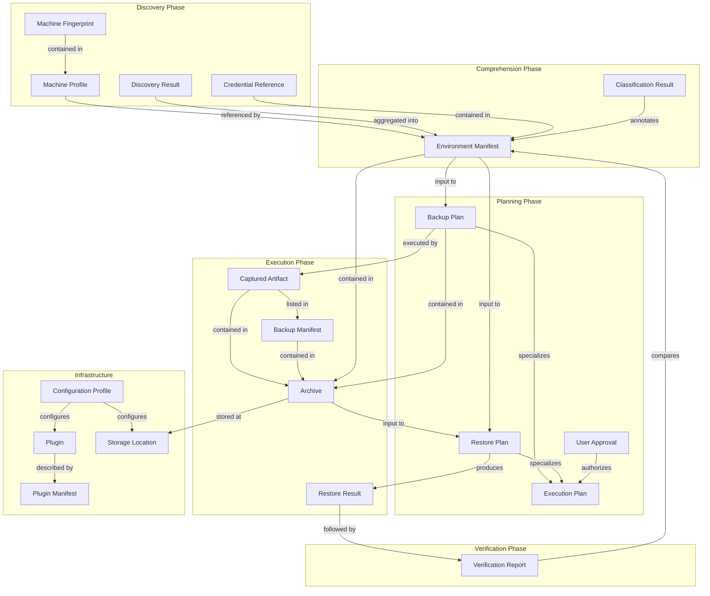

# Telos — Data Model

> **Status:** Draft
> **Last Updated:** 2026-07-01
> **Owner:** temanhattan
> **Audience:** All future contributors, AI sessions, and design reviewers
> **Source of Truth:** [00_Vision.md](00_Vision.md), [01_Requirements.md](01_Requirements.md), [02_Architecture.md](02_Architecture.md), [03_Threat_Model.md](03_Threat_Model.md), [05_Plugin_API.md](05_Plugin_API.md)

---

## Table of Contents

1. [Purpose](#1-purpose)
2. [Design Principles](#2-design-principles)
3. [Core Entities](#3-core-entities)
   - [Machine Profile](#machine-profile)
   - [Environment Manifest](#environment-manifest)
   - [Backup Manifest](#backup-manifest)
   - [Archive](#archive)
   - [Backup Plan](#backup-plan)
   - [Restore Plan](#restore-plan)
   - [Execution Plan](#execution-plan)
   - [Plugin](#plugin)
   - [Plugin Manifest](#plugin-manifest)
   - [Captured Artifact](#captured-artifact)
   - [Verification Report](#verification-report)
   - [Machine Fingerprint](#machine-fingerprint)
   - [Storage Location](#storage-location)
   - [Configuration Profile](#configuration-profile)
   - [Credential Reference](#credential-reference)
   - [Discovery Result](#discovery-result)
   - [Classification Result](#classification-result)
   - [Restore Result](#restore-result)
   - [User Approval](#user-approval)
4. [Entity Relationships](#4-entity-relationships)
5. [Entity Lifecycles](#5-entity-lifecycles)
6. [Identity Strategy](#6-identity-strategy)
7. [Data Ownership](#7-data-ownership)
8. [Persistence Strategy](#8-persistence-strategy)
9. [Versioning Strategy](#9-versioning-strategy)
10. [Traceability](#10-traceability)

---

## 1. Purpose

The Data Model defines the canonical domain vocabulary of Telos. It specifies every conceptual entity the system creates, manages, or references — their purpose, responsibilities, relationships, lifecycles, and ownership.

This document serves three roles:

1. **Shared language.** Every document, design discussion, and implementation session uses the entity names and semantics defined here. There is no ambiguity about what a "Backup Plan" means versus a "Restore Plan," or what an "Archive" contains versus an "Environment Manifest."

2. **Structural constraint.** The relationships and lifecycle rules defined here constrain how the system may be implemented. An entity's ownership, immutability contract, and identity strategy are architectural invariants — not suggestions.

3. **Traceability root.** Every entity traces to one or more functional requirements (FR), data requirements (DR), non-functional requirements (NFR), and architecture subsystems (S). If an entity cannot be traced, it does not belong in the model.

This document defines **conceptual domain models only.** It does not prescribe Go structs, classes, JSON schemas, serialization formats, or storage representations. Those decisions belong to implementation-level design documents.

---

## 2. Design Principles

The following principles govern the data model. They are derived from the [Project Vision](00_Vision.md) and enforced by the [System Architecture](02_Architecture.md).

### 2.1 Single Source of Truth

Every piece of domain information has exactly one authoritative representation. The Environment Manifest is the single source of truth for a discovered environment. The Backup Plan is the single source of truth for what will be captured. The Archive is the single source of truth for what was captured. No entity duplicates the authoritative data of another; entities reference each other by stable identifiers.

### 2.2 Immutable Manifests

Once produced, the discovery data within an Environment Manifest is immutable. Subsequent processing — classification, AI advisory, user overrides — may add or modify **annotations** but may never alter the discovered facts. This guarantees that the raw discovery record is always preserved, auditable, and reproducible.

This immutability extends to all manifest-like entities: the Backup Manifest within an Archive, the integrity hash manifest, and the Plugin Manifest. Once sealed, these records are frozen.

### 2.3 Stable Identifiers

Every persistent entity carries a stable, globally unique identifier that does not change across its lifetime. Identifiers are assigned at creation time and are never reused, recycled, or reassigned. Two entities with different identifiers are always distinct. The same entity referenced from different contexts is always identified by the same identifier.

### 2.4 Explicit Ownership

Every entity has exactly one owning subsystem. The owning subsystem is the only subsystem authorized to create, modify, or delete the entity. Other subsystems may read the entity but must not mutate it. Ownership is documented per entity and enforced at the architectural level.

### 2.5 Versioned Entities

Entities that evolve over time carry an explicit version identifier. When the schema of an entity changes, its version is incremented. Consumers of versioned entities must validate the version before processing and reject entities with incompatible versions. This enables forward and backward compatibility across Telos releases.

### 2.6 Auditability

Every entity that participates in a security-critical operation — archives, plans, approvals, verification reports — carries sufficient metadata to reconstruct the chain of events after the fact. This includes creation timestamps, source identifiers, operation context, and decision records. The Logging & Audit Subsystem (S16) records events; the data model ensures the entities themselves carry the traceability data.

### 2.7 Separation of Facts and Judgments

The data model distinguishes between **facts** (what was discovered) and **judgments** (what the system or user decided about what was discovered). Facts are immutable and authoritative. Judgments are annotations, overridable and attributable. This separation ensures that the user can always inspect the raw data independently of the system's interpretation.

### 2.8 Credential Isolation

Entities that reference or contain credential materials are structurally separated from general data entities. Credential References exist as distinct entities, not as inline fields within broader entities. This structural separation mirrors the cryptographic separation enforced by the Crypto Engine (S9) and Capture Engine (S7).

---

## 3. Core Entities

---

### Machine Profile

**Purpose**

The Machine Profile represents the identity and hardware characteristics of a specific computing environment at a specific point in time. It answers the question: *"What machine is this?"*

**Responsibilities**

- Record the identity of the source or target machine: hostname, hardware identifiers, and physical characteristics.
- Provide the context needed for compatibility validation during restore (same OS family, same CPU architecture).
- Enable correlation of multiple backups taken from the same machine over time.

**Relationships**

- Contains exactly one **Machine Fingerprint** (the stable hardware identity).
- Referenced by every **Environment Manifest** produced from this machine.
- Referenced by every **Archive** produced from this machine.

**Lifecycle**

- Created during the discovery phase when Telos first encounters a machine.
- Updated if hardware characteristics change between backup sessions (e.g., RAM upgrade, new network interface).
- Never deleted — historical profiles are retained for traceability.

**Ownership**

- Owned by **S3 — Discovery Engine**.

**Required Metadata**

- Hostname.
- Hardware profile summary (CPU architecture, core count, memory, primary storage).
- Machine Fingerprint reference.
- First-seen timestamp.
- Last-seen timestamp.

---

### Environment Manifest

**Purpose**

The Environment Manifest is the canonical, machine-readable description of a discovered computing environment. It is the single most important entity in the Telos data model — the foundation upon which classification, planning, capture, storage, restore, and verification all depend.

**Responsibilities**

- Store the complete results of a discovery scan, organized by category: platform, packages, services, user configuration, credentials, environment variables, scheduled tasks, network, cloud metadata, and user data.
- Support annotations added by the Classifier (S5) and AI Advisory Layer (S13) without altering the underlying discovery facts.
- Provide a versioned schema to enable forward and backward compatibility across Telos releases.
- Serve as input to the Planner, Diff Engine, and Verification Engine.

**Relationships**

- References exactly one **Machine Profile** (the machine that was discovered).
- Contains zero or more **Credential References** (detected credential locations).
- Contains zero or more **Discovery Results** (one per discovery category).
- Contains zero or more **Classification Results** (annotations from the Classifier).
- Referenced by **Backup Plans** (as the source manifest).
- Referenced by **Restore Plans** (as the target state to reconstruct).
- Referenced by **Verification Reports** (as the baseline for comparison).
- Contained within **Archives** (as the authoritative record of what was backed up).
- Stored in the **local encrypted manifest cache** for efficient comparison.

**Lifecycle**

- Created by the Discovery Engine during the discovery phase.
- Annotated by the Classifier and AI Advisory Layer during the classification phase.
- Sealed (made immutable) once annotation is complete and the manifest enters the planning phase.
- Stored inside the encrypted Archive after backup.
- Stored in the local encrypted manifest cache for efficient diffing.
- Never modified after sealing — only annotations may be added before the seal point.

**Ownership**

- Owned by **S4 — Environment Manifest** (subsystem).
- Discovery data written by **S3 — Discovery Engine**.
- Annotations written by **S5 — Classifier** and **S13 — AI Advisory Layer**.

**Required Metadata**

- Schema version.
- Creation timestamp.
- Source hostname.
- Telos version that produced the manifest.
- Discovery duration.
- Machine Profile reference.
- Completeness status (which discovery categories succeeded vs. failed).

---

### Backup Manifest

**Purpose**

The Backup Manifest is the cryptographic integrity record that accompanies every Archive. It lists every artifact contained in the archive along with its cryptographic hash, enabling tamper detection and corruption detection before restore.

**Responsibilities**

- Record the hash of every captured artifact within the archive.
- Record the hash algorithm used for each entry.
- Enable the Crypto Engine to verify the integrity of the entire archive before restore proceeds.
- Serve as evidence of what was captured at backup time.

**Relationships**

- Contained within exactly one **Archive**.
- References every **Captured Artifact** within the same Archive.
- Consumed by the **Crypto Engine** (S9) during the integrity verification chain.

**Lifecycle**

- Created by the Capture Engine during backup execution, as each artifact is captured and hashed.
- Sealed once all artifacts are captured and the archive is assembled.
- Immutable after sealing — it is a cryptographic record and cannot be modified.
- Verified by the Crypto Engine during restore before any data is extracted.

**Ownership**

- Owned by **S7 — Capture Engine** (created).
- Verified by **S9 — Crypto Engine** (consumed).

**Required Metadata**

- Archive identifier (the Archive this manifest belongs to).
- Hash algorithm identifier.
- Total artifact count.
- Per-artifact entries: artifact identifier, relative path within archive, hash value, size.

---

### Archive

**Purpose**

The Archive is the encrypted, integrity-verified, self-contained package that holds everything needed to reconstruct an environment. It is the primary deliverable of the backup pipeline and the primary input to the restore pipeline.

**Responsibilities**

- Contain all captured artifacts, organized by category and credential isolation status.
- Contain the Environment Manifest that describes the backed-up environment.
- Contain the Backup Plan that authorized the capture.
- Contain the Backup Manifest (integrity hash manifest) that enables verification.
- Be encrypted in its entirety before being written to storage.
- Be optionally digitally signed for tamper evidence and non-repudiation.
- Carry sufficient metadata for listing, identification, and retrieval without decryption.

**Relationships**

- Contains one **Environment Manifest**.
- Contains one **Backup Plan**.
- Contains one **Backup Manifest** (integrity hash manifest).
- Contains zero or more **Captured Artifacts** (general segment).
- Contains zero or more **Captured Artifacts** (credential-isolated segment, encrypted with separate key material).
- Stored at one or more **Storage Locations**.
- Produced by the **Capture Engine** (S7), encrypted by the **Crypto Engine** (S9), written by the **Storage Backend** (S8).
- Consumed by the **Restore Engine** (S10) during restore.

**Lifecycle**

- Created during backup execution after the Backup Plan is approved.
- Encrypted and written to storage — this is its persistent form.
- Retrieved, decrypted, and verified during restore.
- Retained according to the configured retention policy.
- Deleted when the retention policy expires or the user explicitly removes it.

**Ownership**

- Owned by **S8 — Storage Backend** (persistence).
- Created by **S7 — Capture Engine** (assembly).
- Protected by **S9 — Crypto Engine** (encryption, signing, verification).

**Required Metadata**

- Globally unique identifier (UUID).
- Creation timestamp.
- Optional user-defined label.
- Source hostname.
- Source Machine Profile reference.
- Source Environment Manifest schema version.
- Telos version that produced the archive.
- Archive size (encrypted).
- Encryption algorithm identifier.
- Digital signature (if signed).

---

### Backup Plan

**Purpose**

The Backup Plan is the human-reviewable specification of exactly what will be captured during a backup operation. It is the contract between the system's intelligence (discovery + classification + planning) and the user's authority (Approval Gate).

**Responsibilities**

- List every artifact to be captured, with the capture method (reference, file copy, or config export), the reason for inclusion, the estimated size, and the credential isolation flag.
- List every manifest entry excluded from capture, with the reason for exclusion.
- Provide an estimated total archive size.
- Incorporate user-defined include/exclude rules from the Configuration Profile.
- Serve as input to the Approval Gate — the user must approve, reject, or modify the plan before execution.

**Relationships**

- References one **Environment Manifest** (the annotated manifest from which the plan was derived).
- References zero or more **Credential References** (flagged for credential isolation).
- References one **Configuration Profile** (for user overrides).
- Consumed by the **Capture Engine** (S7) to execute the approved capture.
- Contained within the **Archive** (as a record of what was planned).
- Authorized by one **User Approval**.

**Lifecycle**

- Created by the Planner (S6) during the planning phase.
- Presented to the user through the Approval Gate.
- Modified by the user if they choose to adjust the plan.
- Approved or rejected by the user — only approved plans proceed to execution.
- Stored inside the Archive after successful execution.

**Ownership**

- Owned by **S6 — Planner**.

**Required Metadata**

- Plan version.
- Creation timestamp.
- Source Environment Manifest reference.
- Estimated total archive size.
- Total action count.
- Total exclusion count.
- Warning count and severity distribution.

---

### Restore Plan

**Purpose**

The Restore Plan is the human-reviewable specification of exactly what will be performed on a target machine during environment reconstruction. It is the most security-critical plan entity — it authorizes write operations on the target machine.

**Responsibilities**

- List every action to be performed on the target machine, organized into ordered phases with dependency-aware sequencing.
- Specify the canonical phase order: Package Installation → Configuration Application → Credential Restoration → Data Restoration → Service Configuration → Environment & Scheduled Tasks.
- Identify potential conflicts between the backup state and the target machine's current state.
- Specify a rollback action for each restore action.
- Mark each action as destructive or non-destructive.
- Serve as input to the Approval Gate — the user must approve before any target modification occurs.

**Relationships**

- References one **Archive** (the archive being restored).
- References one **Environment Manifest** (the original manifest from the archive).
- Contains ordered references to restore actions, each of which may reference **Captured Artifacts**.
- Contains zero or more detected conflicts.
- Consumed by the **Restore Engine** (S10) to execute the approved restore.
- Authorized by one **User Approval**.
- Produces one **Restore Result** upon completion.

**Lifecycle**

- Created by the Planner (S6) after the Archive is retrieved, decrypted, and integrity-verified.
- Presented to the user through the Approval Gate.
- Modified by the user if they choose to adjust the plan.
- Approved or rejected by the user — only approved plans proceed to execution.
- Archived in audit logs after execution completes.

**Ownership**

- Owned by **S6 — Planner**.

**Required Metadata**

- Plan version.
- Creation timestamp.
- Target OS family and architecture (for compatibility verification).
- Source Archive reference.
- Source Environment Manifest reference.
- Phase count.
- Total action count.
- Destructive action count.
- Conflict count and severity distribution.
- Warning count.

---

### Execution Plan

**Purpose**

The Execution Plan is the general term for any plan that must pass through the Approval Gate before the system takes action. It is the abstract parent concept of both the Backup Plan and the Restore Plan.

**Responsibilities**

- Define the common contract that all plans share: they are human-reviewable, they are presented through the Approval Gate, and they require explicit user authorization before execution.
- Ensure that no destructive operation occurs without a plan.

**Relationships**

- Specialized into **Backup Plan** and **Restore Plan**.
- Authorized by one **User Approval**.
- Presented through the CLI Shell (S1) Approval Gate.

**Lifecycle**

- Created by the Planner (S6).
- Presented to the user.
- Approved, rejected, or modified.
- Executed (if approved) or discarded (if rejected).

**Ownership**

- Owned by **S6 — Planner**.

**Required Metadata**

- Plan type (backup or restore).
- Plan version.
- Creation timestamp.
- Approval status (pending, approved, rejected, modified).

---

### Plugin

**Purpose**

A Plugin is an executable extension module that provides platform-specific functionality without modifying the Telos core. Plugins are the mechanism by which Telos supports new operating systems, package managers, cloud providers, storage backends, and classification rules.

**Responsibilities**

- Implement one of the five defined plugin type contracts: Discovery, Classification Rule, Capture, Restore, or Storage.
- Declare its identity, capabilities, target interface version, and required permissions.
- Operate within the sandbox boundaries enforced by the Plugin Host.
- Accept requests from the Plugin Host and return structured responses.
- Fail safely — a plugin failure must never crash the core.

**Relationships**

- Described by exactly one **Plugin Manifest** (the plugin's self-declaration).
- Registered with the **Plugin Host** (S12).
- Dispatched by the Plugin Host to serve requests from core subsystems (S3, S5, S7, S10, S8).
- Produces **Discovery Results** (if a Discovery Plugin).
- Produces **Classification Results** (if a Classification Rule Plugin).
- Produces **Captured Artifacts** (if a Capture Plugin).
- Produces **Restore Results** (if a Restore Plugin).

**Lifecycle**

- Discovered by the Plugin Host from configured plugin directories at startup.
- Validated: interface version compatibility, manifest schema, signature (based on trust model).
- Registered in the Plugin Host's capability registry.
- Dispatched to serve requests during pipeline execution.
- Terminated after request completion or on timeout/failure.
- Re-validated on Telos restart.

**Ownership**

- Owned by **S12 — Plugin Host**.

**Required Metadata**

- Plugin identifier (unique within the registry).
- Plugin name (human-readable).
- Plugin version.
- Target interface version.
- Plugin type (Discovery, Classification Rule, Capture, Restore, Storage).
- Trust tier (Official, Community, Unsigned).

---

### Plugin Manifest

**Purpose**

The Plugin Manifest is the self-declaration that accompanies every plugin package. It describes the plugin's identity, capabilities, permission requirements, and interface contract. The Plugin Host reads and validates this manifest before allowing the plugin to register.

**Responsibilities**

- Declare the plugin's identity: name, version, author, description.
- Declare the target plugin interface version for compatibility enforcement.
- Declare the plugin's type and capabilities: which OS families, package managers, cloud providers, or storage protocols it supports.
- Declare the plugin's required permissions: filesystem paths, network access, subprocess access.
- Serve as the basis for trust verification: the manifest is included in the plugin's digital signature.

**Relationships**

- Belongs to exactly one **Plugin**.
- Read and validated by the **Plugin Host** (S12) during the validation phase.
- Referenced during capability negotiation and dispatch.

**Lifecycle**

- Created by the plugin author as part of the plugin package.
- Read by the Plugin Host at startup.
- Validated against the Plugin API schema.
- Immutable during the plugin's registered lifetime — changes require a new plugin version.

**Ownership**

- Created by the plugin author (external).
- Validated and consumed by **S12 — Plugin Host**.

**Required Metadata**

- Plugin identifier.
- Plugin name.
- Plugin version.
- Author.
- Description.
- Target interface version.
- Plugin type.
- Capabilities (OS families, package managers, cloud providers, storage protocols).
- Permissions (filesystem paths, network, subprocess).
- Signature (for Official and Community trust tiers).

---

### Captured Artifact

**Purpose**

A Captured Artifact is a single unit of data captured from the source machine during backup execution. It represents one item from the Backup Plan that was successfully collected and included in the Archive.

**Responsibilities**

- Hold the captured data: either file contents (for file copy), a reference record (for reference capture), or an exported configuration (for config export).
- Carry its cryptographic hash for integrity verification.
- Carry metadata about its origin: source path, capture method, category, and credential isolation status.
- Be individually verifiable against the Backup Manifest's hash entries.

**Relationships**

- Contained within exactly one **Archive**.
- Referenced by the **Backup Manifest** (hash entry).
- Produced by the **Capture Engine** (S7), potentially via a **Capture Plugin**.
- Corresponds to one action in the **Backup Plan**.
- Consumed by the **Restore Engine** (S10) during restore execution.

**Lifecycle**

- Created during backup execution when the Capture Engine processes a Backup Plan action.
- Hashed immediately after creation by the Crypto Engine.
- Packaged into the Archive (general segment or credential-isolated segment).
- Verified during restore by comparing its hash against the Backup Manifest.
- Restored to the target machine by the Restore Engine.

**Ownership**

- Owned by **S7 — Capture Engine** (created).
- Stored by **S8 — Storage Backend** (as part of the Archive).

**Required Metadata**

- Artifact identifier (unique within the Archive).
- Source path on the original machine.
- Capture method (reference, file copy, config export).
- Category (package, configuration, credential, data, service, environment, scheduled task).
- Cryptographic hash value.
- Hash algorithm identifier.
- Size in bytes.
- Credential isolation flag.
- Capture timestamp.
- Capture status (success, failed, partial).

---

### Verification Report

**Purpose**

The Verification Report is the structured comparison of a restored environment against the original, providing the user with confidence (or concern) about the quality of the restoration.

**Responsibilities**

- List every difference between the post-restore Environment Manifest and the original source Environment Manifest.
- Classify each difference by severity: Expected, Acceptable, Concerning, or Critical.
- Provide a summary of total differences by severity and by manifest section.
- Provide an overall pass/fail verdict based on configurable tolerance thresholds.
- Present the report to the user without prescribing remediation — the Verification Engine reports problems; it does not fix them.

**Relationships**

- References two **Environment Manifests**: the original (from the Archive) and the post-restore (from a fresh discovery of the target).
- Produced by the **Verification Engine** (S11) using the **Diff Engine** (S14).
- Follows one **Restore Result** (the restore must complete before verification).
- Presented to the user through the **CLI Shell** (S1).

**Lifecycle**

- Created after restore execution completes.
- Presented to the user immediately.
- Archived for audit purposes.
- Never modified — each verification produces a new report.

**Ownership**

- Owned by **S11 — Verification Engine**.

**Required Metadata**

- Report identifier.
- Creation timestamp.
- Source Archive reference.
- Original Environment Manifest reference.
- Post-restore Environment Manifest reference.
- Tolerance thresholds applied.
- Overall verdict (pass or fail).
- Summary: total differences by severity (Expected, Acceptable, Concerning, Critical).
- Summary: total differences by manifest section.

---

### Machine Fingerprint

**Purpose**

The Machine Fingerprint is a stable identity marker for a specific physical or virtual machine. It enables Telos to determine whether the current machine is the same machine that produced a previous backup, even if the hostname has changed.

**Responsibilities**

- Provide a stable identifier derived from hardware or platform characteristics that persist across OS reinstallations.
- Enable correlation of multiple backups and Environment Manifests from the same machine.
- Support compatibility validation during restore: confirm that the target machine meets the constraints for the selected Archive (same OS family, same CPU architecture).

**Relationships**

- Contained within exactly one **Machine Profile**.
- Referenced by **Environment Manifests** for machine identity correlation.
- Used by the **Planner** (S6) during restore planning for compatibility verification.

**Lifecycle**

- Created during the first discovery of a machine.
- Recomputed on subsequent discoveries to detect hardware changes.
- Never deleted — fingerprints persist as historical records.

**Ownership**

- Owned by **S3 — Discovery Engine**.

**Required Metadata**

- Fingerprint value (derived from hardware identifiers).
- OS family.
- CPU architecture.
- Generation timestamp.
- Derivation method (which hardware characteristics were used).

---

### Storage Location

**Purpose**

A Storage Location represents a configured destination where Archives are stored. It abstracts the physical storage medium — local filesystem, external drive, network-attached storage, or future cloud storage — behind a uniform identity.

**Responsibilities**

- Identify where Archives are written and from where they are retrieved.
- Carry connection or path information needed by the Storage Backend to access the medium.
- Support multiple locations: the user may configure primary and secondary storage destinations.
- Enable the Storage Backend to list, verify, and manage Archives at each location.

**Relationships**

- Referenced by **Archives** (where the Archive is stored).
- Configured through the **Configuration Profile**.
- Managed by the **Storage Backend** (S8).
- Extended by **Storage Plugins** for non-local backends.

**Lifecycle**

- Created when the user configures a storage destination.
- Active as long as the configuration references it.
- Deactivated or removed when the user modifies the configuration.

**Ownership**

- Owned by **S8 — Storage Backend**.
- Configured by **S17 — Configuration Manager**.

**Required Metadata**

- Location identifier.
- Location type (local filesystem, external media, network storage, cloud — future).
- Path or connection string.
- Available space (if determinable).
- Last-verified timestamp.

---

### Configuration Profile

**Purpose**

The Configuration Profile represents the merged, validated configuration that governs Telos behavior on a given machine. It is the output of the Configuration Manager's merge-and-validate process, incorporating all configuration sources in priority order.

**Responsibilities**

- Provide a single, coherent set of configuration values to all consuming subsystems.
- Record the effective value for each configuration parameter and the source from which it was derived (CLI flag, environment variable, user config, system config, or built-in default).
- Enforce schema validation: reject unknown keys, enforce required fields, validate types and value ranges.
- Support introspection: the user can inspect the effective configuration and understand why each value is what it is.

**Relationships**

- Consumed by all subsystems that read configuration: S2, S5, S6, S8, S9, S12, S13, S15.
- References zero or more **Storage Locations** (configured destinations).
- References plugin directory paths (for plugin discovery).
- References scheduling definitions (for the Scheduler).
- Contains user-defined include/exclude rules consumed by the **Backup Plan**.

**Lifecycle**

- Created at Telos startup by the Configuration Manager.
- Read-only during the lifetime of the process — the Configuration Manager does not write configuration files.
- Rebuilt from sources on each Telos invocation.

**Ownership**

- Owned by **S17 — Configuration Manager**.

**Required Metadata**

- Effective configuration values.
- Source attribution for each value (CLI, env var, user config, system config, default).
- Schema version.
- Validation timestamp.
- Validation status (valid or the specific validation error).

---

### Credential Reference

**Purpose**

A Credential Reference is a pointer to a sensitive credential material detected on the source machine. During discovery, Telos detects the location and type of credentials but does not read their contents. The Credential Reference records what was found and where, enabling the Backup Plan to flag these items for credential isolation during capture.

**Responsibilities**

- Record the type of credential: SSH private key, SSH public key, GPG secret key, API token, certificate, database password, or other sensitive material.
- Record the filesystem path where the credential was detected.
- Record a fingerprint (for keys) or other non-sensitive identifier.
- Enable the Backup Plan to flag these items for credential-isolated capture.
- Never contain the actual credential contents — only metadata about the credential's existence and location.

**Relationships**

- Contained within the **Environment Manifest** (credentials section).
- Referenced by the **Backup Plan** (to flag for credential isolation).
- Corresponds to **Captured Artifacts** in the credential-isolated segment of the **Archive**.

**Lifecycle**

- Created during discovery by a Discovery Plugin.
- Included in the Environment Manifest.
- Flagged for credential isolation during backup planning.
- The referenced credential contents are captured during backup execution into the credential-isolated segment.
- The Credential Reference itself (metadata only) persists in the Environment Manifest and Archive.

**Ownership**

- Owned by **S3 — Discovery Engine** (created via plugins).
- Referenced by **S6 — Planner** and **S7 — Capture Engine**.

**Required Metadata**

- Credential type (ssh-key, gpg-key, api-token, certificate, other).
- Filesystem path.
- Fingerprint (for keys, if determinable without reading contents).
- Detected timestamp.
- Annotations (added by Classifier).

---

### Discovery Result

**Purpose**

A Discovery Result represents the output of a single discovery category scan performed by one or more Discovery Plugins. It is the raw material from which the Environment Manifest is assembled.

**Responsibilities**

- Carry the discovered entries for one category (platform, packages, services, user configuration, credentials, environment variables, scheduled tasks, network, cloud metadata, or user data).
- Record the plugin that produced the result.
- Record the completeness status: whether the discovery for this category succeeded fully, partially, or failed.
- Be assembled into the Environment Manifest by the Discovery Engine.

**Relationships**

- Produced by one or more **Discovery Plugins** (via the Plugin Host).
- Aggregated by the **Discovery Engine** (S3) into the **Environment Manifest**.

**Lifecycle**

- Created during discovery when a plugin returns its response.
- Aggregated into the Environment Manifest immediately.
- Discarded as a standalone entity once incorporated into the manifest — the manifest is the authoritative record.

**Ownership**

- Owned by **S3 — Discovery Engine**.

**Required Metadata**

- Discovery category.
- Source plugin identifier.
- Completeness status (complete, partial, failed).
- Entry count.
- Failure reason (if partial or failed).
- Duration.

---

### Classification Result

**Purpose**

A Classification Result represents the annotations applied to an Environment Manifest entry by the classification process. It captures the system's judgment about the role, importance, intent, and reproducibility of a discovered item.

**Responsibilities**

- Record the machine role classification (for the overall manifest).
- Record per-entry annotations: importance level, intent description, reproducibility tag, and backup category.
- Record the classification source: deterministic rule, plugin-provided rule, or AI suggestion.
- For AI-sourced annotations, record the confidence score and reasoning.
- Be attached to the Environment Manifest as annotations without modifying the underlying discovery data.

**Relationships**

- Applied to entries within the **Environment Manifest**.
- Produced by the **Classifier** (S5), using deterministic rules, **Classification Rule Plugins**, and optionally the **AI Advisory Layer** (S13).
- Consumed by the **Planner** (S6) to generate the Backup Plan.

**Lifecycle**

- Created during the classification phase.
- Attached to the manifest as annotations.
- Frozen when the manifest is sealed for planning.
- Overridable by user decisions (through the Configuration Profile or Approval Gate).

**Ownership**

- Owned by **S5 — Classifier**.

**Required Metadata**

- Target manifest entry reference.
- Importance level (critical, recommended, optional, transient).
- Intent description (human-readable string).
- Reproducibility tag (reproducible or irreplaceable).
- Classification source (deterministic, plugin, AI).
- Confidence score (for AI-sourced annotations).
- Reasoning (for AI-sourced annotations).

---

### Restore Result

**Purpose**

A Restore Result is the structured record of what happened during restore execution. It captures the outcome of every action in the Restore Plan, enabling audit, troubleshooting, and post-restore verification.

**Responsibilities**

- Record the outcome of every restore action: success, failure, skipped, or rolled back.
- Record checkpoint information for resumable restores.
- Record any errors encountered and the user's chosen response (skip, retry, rollback, abort).
- Serve as input to the Verification Engine to contextualize verification results.
- Provide the audit trail required by NFR-7.

**Relationships**

- Corresponds to one **Restore Plan** (the plan that was executed).
- References one **Archive** (the archive that was restored).
- Followed by one **Verification Report** (if verification is performed).
- Logged by the **Logging & Audit Subsystem** (S16).

**Lifecycle**

- Created when restore execution begins.
- Updated incrementally as each action completes.
- Finalized when restore execution completes (either successfully or after abort).
- Archived for audit purposes.
- Never modified after finalization.

**Ownership**

- Owned by **S10 — Restore Engine**.

**Required Metadata**

- Result identifier.
- Restore Plan reference.
- Archive reference.
- Start timestamp.
- End timestamp.
- Overall outcome (completed, partial, aborted, resumed).
- Per-action outcomes (success, failure, skipped, rolled back).
- Checkpoint state (last successful action, resumable flag).
- Error log (per failed action: error description, user response).

---

### User Approval

**Purpose**

A User Approval is the record of a human decision at the Approval Gate. It captures whether the user approved, rejected, or modified an Execution Plan, along with the context of the decision.

**Responsibilities**

- Record the user's decision: approve, reject, or modify.
- Record what was presented to the user at decision time (plan reference).
- Record when the decision was made.
- Provide the non-repudiation trail for audit purposes.
- Ensure that no destructive operation can proceed without an associated approved User Approval.

**Relationships**

- Authorizes one **Execution Plan** (either a Backup Plan or a Restore Plan).
- Logged by the **Logging & Audit Subsystem** (S16) at `audit` severity.
- Presented through the **CLI Shell** (S1) Approval Gate.

**Lifecycle**

- Created when the user responds to the Approval Gate.
- Immutable after creation — a decision, once recorded, cannot be retroactively changed.
- Archived in audit logs.

**Ownership**

- Owned by **S1 — CLI Shell** (captured at the Approval Gate).
- Logged by **S16 — Logging & Audit Subsystem**.

**Required Metadata**

- Approval identifier.
- Execution Plan reference (plan type and plan identifier).
- Decision (approved, rejected, modified).
- Timestamp.
- Modifications made (if the user modified the plan, a summary of changes).

---

## 4. Entity Relationships

The following diagram illustrates the primary relationships between all core entities. Arrows indicate "produces," "contains," or "references" relationships.



### Primary Relationship Chain

The backbone of the Telos data model follows the core pipeline:

```
Machine Profile
    ↓ identifies
Environment Manifest
    ↓ drives
Backup Plan
    ↓ authorized by
User Approval
    ↓ executed as
Captured Artifacts → Backup Manifest → Archive
    ↓ stored at
Storage Location
    ↓ retrieved for
Restore Plan
    ↓ authorized by
User Approval
    ↓ executed as
Restore Result
    ↓ verified by
Verification Report
```

### Cross-Cutting Relationships

| Relationship | From | To | Nature |
|-------------|------|-----|--------|
| Configuration governs behavior | Configuration Profile | All subsystems | Read-only consumption |
| Plugins produce domain data | Plugin | Discovery Result, Classification Result, Captured Artifact, Restore Result | Production |
| Plugin manifest describes plugin | Plugin Manifest | Plugin | One-to-one identity |
| Credentials isolated structurally | Credential Reference | Captured Artifact (credential segment) | Structural separation |
| Approval gates all plans | User Approval | Execution Plan | Authorization |
| Audit records all decisions | User Approval, Restore Result | Logging & Audit Subsystem | Event recording |

---

## 5. Entity Lifecycles

### 5.1 Lifecycle Summary

| Entity | Creation Trigger | Mutation Model | Archival | Deletion |
|--------|-----------------|----------------|----------|----------|
| Machine Profile | First discovery of a machine | Updatable (hardware changes) | Never archived — always active | Never deleted |
| Environment Manifest | Discovery phase completion | Annotations only (facts immutable) | Stored in Archive and manifest cache | Cache entries expire per retention policy |
| Backup Manifest | Capture phase completion | Immutable after sealing | Stored inside Archive | Deleted with Archive |
| Archive | Backup execution completion | Immutable after creation | Retention policy governs lifecycle | Deleted per retention policy or user action |
| Backup Plan | Planning phase | Modifiable by user before approval | Stored inside Archive | Discarded if rejected |
| Restore Plan | Restore planning phase | Modifiable by user before approval | Logged in audit trail | Discarded after execution or rejection |
| Execution Plan | Planning phase | Modifiable before approval | Varies by subtype | Varies by subtype |
| Plugin | Plugin Host startup | Updatable (new version replaces old) | Deregistered on removal | User uninstalls |
| Plugin Manifest | Plugin packaging (external) | Immutable per version | Replaced by new version | Deleted with plugin |
| Captured Artifact | Capture execution | Immutable after creation | Stored inside Archive | Deleted with Archive |
| Verification Report | Post-restore verification | Immutable after creation | Archived for audit | Never deleted — audit record |
| Machine Fingerprint | First discovery | Recomputed on subsequent discovery | Never archived — always active | Never deleted |
| Storage Location | User configuration | Updatable via configuration change | Deactivated on config removal | User removes from config |
| Configuration Profile | Telos startup | Rebuilt on each invocation | Not persisted — transient | Rebuilt next invocation |
| Credential Reference | Discovery phase | Immutable (part of manifest) | Stored within Environment Manifest | Deleted with manifest |
| Discovery Result | Plugin response | Immutable | Incorporated into manifest | Discarded after aggregation |
| Classification Result | Classification phase | Frozen at manifest seal | Stored as manifest annotations | Deleted with manifest |
| Restore Result | Restore execution start | Updated incrementally, finalized at end | Archived for audit | Never deleted — audit record |
| User Approval | Approval Gate decision | Immutable after creation | Archived in audit log | Never deleted — audit record |

### 5.2 Immutability Rules

The following entities are **immutable after sealing** and must never be modified post-creation:

- **Environment Manifest** (discovery facts only — annotations may be added before seal).
- **Backup Manifest** (cryptographic integrity record).
- **Archive** (encrypted, integrity-verified package).
- **Captured Artifact** (individual integrity-verified data unit).
- **Verification Report** (post-hoc comparison record).
- **User Approval** (non-repudiable decision record).
- **Restore Result** (audit record after finalization).

### 5.3 Seal Points

A **seal point** is the moment in the pipeline when an entity transitions from mutable to immutable.

| Entity | Seal Point | Trigger |
|--------|-----------|---------|
| Environment Manifest (facts) | End of discovery phase | Discovery Engine completes aggregation |
| Environment Manifest (annotations) | End of classification phase | Classifier and AI Advisory complete |
| Backup Plan | User approval | Approval Gate returns `approved` |
| Backup Manifest | End of capture phase | All artifacts captured and hashed |
| Archive | Encryption complete | Crypto Engine finishes encryption |
| Restore Plan | User approval | Approval Gate returns `approved` |
| Restore Result | Restore execution complete | Restore Engine finalizes |
| Verification Report | Report generation complete | Verification Engine produces verdict |
| User Approval | Decision recorded | CLI Shell captures user response |

---

## 6. Identity Strategy

### 6.1 Primary Identifiers

Every persistent entity carries a primary identifier. The identifier strategy depends on the entity's scope and lifetime.

| Entity | Identifier Type | Scope | Assignment |
|--------|----------------|-------|------------|
| Archive | UUID v4 | Global | Assigned at creation by Capture Engine |
| Environment Manifest | UUID v4 | Global | Assigned at creation by Discovery Engine |
| Machine Profile | UUID v4 | Global | Assigned at first discovery |
| Machine Fingerprint | Derived hash | Global | Computed from hardware characteristics |
| Backup Plan | UUID v4 | Global | Assigned at creation by Planner |
| Restore Plan | UUID v4 | Global | Assigned at creation by Planner |
| Captured Artifact | Sequential ID | Archive-local | Assigned during capture, unique within Archive |
| Verification Report | UUID v4 | Global | Assigned at creation by Verification Engine |
| Plugin | Declared name + version | Registry-local | Declared by plugin author in Plugin Manifest |
| Storage Location | User-defined name | Configuration-local | Declared by user in configuration |
| Configuration Profile | N/A (singleton) | Process-local | Rebuilt on each invocation |
| User Approval | UUID v4 | Global | Assigned at decision time |
| Restore Result | UUID v4 | Global | Assigned at execution start |

### 6.2 UUID Requirements

- UUIDs must be version 4 (random) to prevent information leakage from sequential or time-based UUIDs.
- UUIDs are assigned once at creation and never change.
- UUIDs are never reused across the lifetime of the system.

### 6.3 Version Numbers

Versioned entities carry an explicit version field that follows semantic versioning principles:

| Entity | Version Field | Versioning Scheme |
|--------|--------------|-------------------|
| Environment Manifest | `schema_version` | Major.Minor — major increment breaks backward compatibility |
| Backup Plan | `plan_version` | Sequential integer per plan generation |
| Restore Plan | `plan_version` | Sequential integer per plan generation |
| Plugin | `plugin_version` | Semantic versioning (Major.Minor.Patch) |
| Plugin Manifest | `interface_version` | Major.Minor — major increment is a compatibility break |
| Configuration Profile | `schema_version` | Major.Minor — governs config file format |

### 6.4 Timestamps

All timestamps use UTC and include timezone information. Every entity that participates in the audit trail carries a creation timestamp. Entities involved in time-ordered sequences (discovery → classification → planning → execution → verification) carry both start and end timestamps.

### 6.5 Labels

Archives support an optional user-defined label — a human-readable string that helps the user identify archives by purpose rather than by UUID. Labels are not unique; multiple archives may share the same label. Labels are searchable but never used as primary identifiers.

---

## 7. Data Ownership

Every entity has exactly one owning subsystem. The owning subsystem is the sole authority for creating, modifying, and deleting the entity.

| Entity | Owning Subsystem | Create | Read | Modify | Delete |
|--------|-----------------|--------|------|--------|--------|
| Machine Profile | S3 — Discovery Engine | S3 | S2, S4, S6, S11 | S3 | Never |
| Environment Manifest | S4 — Environment Manifest | S3 (facts), S5 (annotations) | S2, S5, S6, S7, S10, S11, S14 | S5, S13 (annotations only) | S8 (via Archive retention) |
| Backup Manifest | S7 — Capture Engine | S7 | S9, S10 | Never (immutable) | S8 (via Archive retention) |
| Archive | S8 — Storage Backend | S7 (assembly), S9 (encryption) | S2, S10 | Never (immutable) | S8 (retention policy) |
| Backup Plan | S6 — Planner | S6 | S1, S2, S7 | S1 (user modifications) | S6 (if rejected) |
| Restore Plan | S6 — Planner | S6 | S1, S2, S10 | S1 (user modifications) | S6 (if rejected) |
| Plugin | S12 — Plugin Host | S12 (registration) | S3, S5, S7, S10, S8 | S12 (re-registration) | S12 (deregistration) |
| Plugin Manifest | S12 — Plugin Host | External (plugin author) | S12 | Never (immutable per version) | S12 (on plugin removal) |
| Captured Artifact | S7 — Capture Engine | S7 | S9, S10 | Never (immutable) | S8 (via Archive retention) |
| Verification Report | S11 — Verification Engine | S11 | S1, S2 | Never (immutable) | Never |
| Machine Fingerprint | S3 — Discovery Engine | S3 | S4, S6 | S3 (recomputed) | Never |
| Storage Location | S8 — Storage Backend | S17 (configured) | S2, S8 | S17 (reconfigured) | S17 (removed from config) |
| Configuration Profile | S17 — Configuration Manager | S17 | All subsystems | Never (rebuilt per invocation) | Transient — not persisted |
| Credential Reference | S3 — Discovery Engine | S3 (via plugins) | S5, S6, S7 | S5 (annotations only) | Via manifest lifecycle |
| Discovery Result | S3 — Discovery Engine | S3 (via plugins) | S4 | Never (aggregated and discarded) | After manifest aggregation |
| Classification Result | S5 — Classifier | S5 | S6, S13 | S5 (before manifest seal) | Via manifest lifecycle |
| Restore Result | S10 — Restore Engine | S10 | S1, S2, S11, S16 | S10 (incremental updates) | Never |
| User Approval | S1 — CLI Shell | S1 | S2, S16 | Never (immutable) | Never |

---

## 8. Persistence Strategy

This section defines which entities are persisted to durable storage and which exist only in volatile memory during a pipeline execution. The strategy is implementation-independent — it specifies **what** is persisted, not **how**.

### 8.1 Persisted Entities

| Entity | Persistence Medium | Encryption | Retention |
|--------|-------------------|------------|-----------|
| Archive | Configured Storage Location | Encrypted at rest (AES-256) | Governed by retention policy |
| Environment Manifest (in Archive) | Inside encrypted Archive | Encrypted with Archive | Governed by Archive retention |
| Environment Manifest (cache) | Local encrypted manifest cache | Encrypted at rest | Governed by cache retention policy |
| Backup Manifest | Inside encrypted Archive | Encrypted with Archive | Governed by Archive retention |
| Backup Plan | Inside encrypted Archive | Encrypted with Archive | Governed by Archive retention |
| Captured Artifacts | Inside encrypted Archive | Encrypted with Archive (general or credential-isolated segment) | Governed by Archive retention |
| Machine Profile | Local Telos data directory | Encrypted at rest | Permanent |
| Audit Logs (including User Approvals) | Local append-only log storage | Not encrypted (no sensitive data) | Governed by log rotation policy |
| Restore Result | Local Telos data directory / audit logs | Not encrypted (no sensitive data) | Permanent (audit record) |
| Verification Report | Local Telos data directory / audit logs | Not encrypted (no sensitive data) | Permanent (audit record) |
| Restore Checkpoints | Local Telos data directory | Not encrypted (operational state) | Deleted after successful restore completion |
| User Configuration | User config file (`~/.telos/config.yaml` or equivalent) | Not encrypted by Telos | User-managed |

### 8.2 Transient Entities

| Entity | Lifetime | Reason |
|--------|----------|--------|
| Configuration Profile | Single process invocation | Rebuilt from sources on each startup |
| Discovery Result | Discovery phase only | Aggregated into Environment Manifest and discarded |
| Classification Result | Classification phase only | Attached to manifest as annotations |
| Execution Plan (pre-approval) | Planning phase only | Either approved (becomes durable via Archive or audit log) or discarded |
| Plugin runtime state | Single request-response cycle | Plugins are stateless |
| Derived encryption keys | Single operation | Received at operation time, discarded on completion |
| Master passphrase | Single operation | Received at operation time, discarded on completion |

### 8.3 Staging Area

During backup execution, captured artifacts exist temporarily in a staging area in plaintext before encryption. This staging area is transient — it exists only for the duration of the backup execution pipeline. The staging area must be treated as a security-sensitive location and cleaned up immediately after the Archive is encrypted and written to storage. See Threat Model AS-8 and I-02 for the associated risks.

---

## 9. Versioning Strategy

### 9.1 Schema Versioning

Entities with a structured schema carry a schema version. Schema versions use a **Major.Minor** convention:

- **Major version increment:** A breaking change to the schema. Consumers that do not understand the new major version must reject the entity. Examples: removing a required field, changing the meaning of an existing field, restructuring the entity hierarchy.
- **Minor version increment:** A backward-compatible change. Consumers that understand the major version can safely process the entity even if they do not understand the minor additions. Examples: adding a new optional field, adding a new annotation type, extending an enumeration.

### 9.2 Versioned Entities

| Entity | Version Field | Current Version | Compatibility Scope |
|--------|--------------|-----------------|---------------------|
| Environment Manifest | `schema_version` | Defined at implementation | Cross-version manifest comparison, Archive portability |
| Backup Plan | `plan_version` | Defined at implementation | Plan execution by Capture Engine |
| Restore Plan | `plan_version` | Defined at implementation | Plan execution by Restore Engine |
| Plugin Interface | `interface_version` | Defined at implementation | Plugin compatibility with Plugin Host |
| Configuration Schema | `schema_version` | Defined at implementation | Configuration file parsing |
| Verification Report | `report_version` | Defined at implementation | Report rendering and comparison |

### 9.3 Backward Compatibility Rules

1. **Archives must be restorable by future Telos versions.** A newer version of Telos must be able to read and restore an Archive produced by an older version. This requires that the Environment Manifest, Backup Manifest, and Backup Plan schemas support backward-compatible reading.

2. **Plugins must declare their target interface version.** The Plugin Host refuses to load plugins targeting a major version it does not support. Minor version mismatches are tolerated — a plugin targeting interface version 1.0 may be loaded by a Plugin Host that implements 1.3, but not by one that implements 2.0.

3. **Configuration files must tolerate unknown keys from future versions.** The Configuration Manager rejects unknown keys during validation, but a future version's configuration schema should be designed so that downgrade scenarios are handled gracefully (unknown keys from a newer version are rejected with a clear error, not silently ignored).

### 9.4 Migration Strategy

When a schema version increments, the following rules apply:

- **Minor version:** No migration required. Consumers ignore fields they do not recognize.
- **Major version:** Telos must include a migration path — either an automatic converter that transforms old-version entities to the new version, or clear documentation that old-version entities must be re-created. Archives from previous major versions must remain readable through a compatibility layer.

---

## 10. Traceability

### 10.1 Entity-to-Requirement Mapping

Every entity in the data model traces to one or more requirements from [01_Requirements.md](01_Requirements.md).

| Entity | Functional Requirements | Data Requirements | Non-Functional Requirements |
|--------|------------------------|-------------------|----------------------------|
| Machine Profile | FR-1.1 (OS identification) | DR-1.3 (manifest metadata) | NFR-4.3 (archive portability) |
| Environment Manifest | FR-1.1–FR-1.14 (discovery), FR-2.1–FR-2.8 (classification) | DR-1.1–DR-1.7 (manifest specification) | NFR-6.1 (explainability) |
| Backup Manifest | FR-4.2 (cryptographic hashes), FR-4.4 (archive assembly) | DR-2.1 (archive contents) | NFR-1.2 (integrity manifest) |
| Archive | FR-4.4–FR-4.15 (backup execution) | DR-2.1–DR-2.7 (archive specification) | NFR-1.1 (encryption), NFR-1.3 (integrity verification) |
| Backup Plan | FR-3.1–FR-3.11 (backup planning) | DR-3.1 (plan structure) | NFR-6.2 (plan reasoning) |
| Restore Plan | FR-5.1–FR-5.9 (restore planning) | DR-3.2 (plan structure) | NFR-6.4 (no modification without approval) |
| Execution Plan | FR-3.8, FR-5.7 (Approval Gate) | DR-3.1, DR-3.2 | NFR-6.4 (human approval) |
| Plugin | FR-12.1–FR-12.8 (plugin system) | — | NFR-5.1–NFR-5.3 (extensibility) |
| Plugin Manifest | FR-12.2 (interface version), FR-12.3 (capabilities) | — | NFR-1.11 (plugin sandboxing) |
| Captured Artifact | FR-4.1–FR-4.6 (backup execution) | DR-2.1 (archive contents), DR-2.5 (credential isolation) | NFR-1.5 (credential tier) |
| Verification Report | FR-7.1–FR-7.7 (verification) | DR-4.1–DR-4.3 (report specification) | NFR-6.1 (explainability) |
| Machine Fingerprint | FR-1.1 (OS/hardware identification) | DR-1.3 (manifest metadata) | NFR-4.3 (archive portability) |
| Storage Location | FR-9.1–FR-9.6 (archive management) | — | NFR-8.1 (offline operation) |
| Configuration Profile | FR-11.1–FR-11.6 (configuration) | — | NFR-6.3 (sensible defaults) |
| Credential Reference | FR-1.5 (credential detection) | DR-1.2 (manifest sections) | NFR-1.5, NFR-1.6 (credential protection) |
| Discovery Result | FR-1.1–FR-1.14 (discovery) | DR-1.1–DR-1.7 | NFR-2.2 (partial failure tolerance) |
| Classification Result | FR-2.1–FR-2.8 (classification) | DR-1.4 (annotations) | NFR-6.1 (explainability) |
| Restore Result | FR-6.1–FR-6.11 (restore execution) | DR-6.1–DR-6.5 (audit log) | NFR-7.1 (auditability), NFR-2.1 (resumability) |
| User Approval | FR-3.8, FR-5.7 (Approval Gate) | DR-6.3 (audit severity) | NFR-6.4 (human approval), NFR-7.4 (audit events) |

### 10.2 Entity-to-Architecture Mapping

Every entity is owned by or interacts with specific architecture subsystems from [02_Architecture.md](02_Architecture.md).

| Entity | Primary Subsystem | Consuming Subsystems |
|--------|------------------|---------------------|
| Machine Profile | S3 — Discovery Engine | S4, S6, S11 |
| Environment Manifest | S4 — Environment Manifest | S2, S3, S5, S6, S7, S10, S11, S14 |
| Backup Manifest | S7 — Capture Engine | S9, S10 |
| Archive | S8 — Storage Backend | S2, S7, S9, S10 |
| Backup Plan | S6 — Planner | S1, S2, S7 |
| Restore Plan | S6 — Planner | S1, S2, S10 |
| Execution Plan | S6 — Planner | S1, S2 |
| Plugin | S12 — Plugin Host | S3, S5, S7, S8, S10 |
| Plugin Manifest | S12 — Plugin Host | S12 |
| Captured Artifact | S7 — Capture Engine | S8, S9, S10 |
| Verification Report | S11 — Verification Engine | S1, S2 |
| Machine Fingerprint | S3 — Discovery Engine | S4, S6 |
| Storage Location | S8 — Storage Backend | S2, S17 |
| Configuration Profile | S17 — Configuration Manager | All subsystems |
| Credential Reference | S3 — Discovery Engine | S5, S6, S7 |
| Discovery Result | S3 — Discovery Engine | S4 |
| Classification Result | S5 — Classifier | S6, S13 |
| Restore Result | S10 — Restore Engine | S1, S2, S11, S16 |
| User Approval | S1 — CLI Shell | S2, S16 |

### 10.3 Entity-to-Threat Mapping

Entities that are identified as security assets in the [Threat Model](03_Threat_Model.md) carry additional security obligations.

| Entity | Threat Model Asset | Sensitivity | Primary Threats |
|--------|-------------------|-------------|-----------------|
| Archive | Backup archives (§3.1) | Highest | I-01, T-01, S-02, D-04 |
| Environment Manifest | Environment Manifest (§3.2) | High | T-02, I-06 |
| Credential Reference / Captured Artifact (credential segment) | Credential materials (§3.1) | Highest | I-01, E-04 |
| Backup Plan / Restore Plan | Backup and Restore Plans (§3.2) | High | T-02, S-02 |
| Plugin / Plugin Manifest | Plugin packages (§3.3) | Medium | S-01, T-05, E-01 |
| Configuration Profile | Telos configuration files (§3.3) | Medium | S-03, E-03 |
| Restore Result / User Approval (in audit logs) | Audit logs (§3.3) | Medium | T-03, R-01 |
| Verification Report | Verification reports (§3.3) | Medium | T-01 (indirectly) |

---

> **This document defines the canonical domain vocabulary of Telos.** Every entity, relationship, lifecycle, and identity strategy described here is an architectural constraint that implementation must respect. If a future design decision introduces new entities, modifies relationships, or changes ownership, this document must be updated through a formal review. The data model is the skeleton of the system — it shapes everything that is built upon it.
